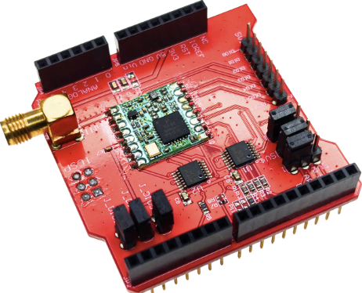
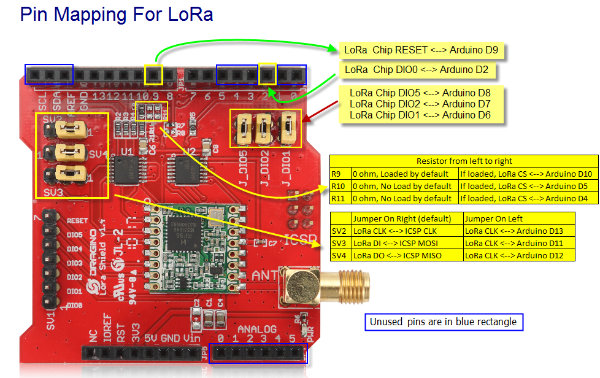

# LoRa Shield v1.2 Dragino  — Arduino Uno Project Collection

> **Hardware:** Dragino LoRa Shield v1.2 &nbsp;·&nbsp; MCU: Arduino Uno (ATmega328P) &nbsp;·&nbsp; LoRa Chip: SX1276 &nbsp;·&nbsp; Frekuensi: **920 MHz**

---






## Daftar Isi

- [Pendahuluan](#pendahuluan)
- [Spesifikasi Shield](#spesifikasi-shield)
- [GPIO Map — Interface LoRa](#gpio-map--interface-lora)
- [GPIO User yang Masih Tersedia](#gpio-user-yang-masih-tersedia)
- [Library yang Digunakan](#library-yang-digunakan)
- [Struktur File & Source Code](#struktur-file--source-code)
- [Referensi](#referensi)

---

## Pendahuluan

Repositori ini berisi kumpulan program Arduino untuk **LoRa Shield v1.2** yang dipasang di atas **Arduino Uno (ATmega328P)**. Shield ini membawa chip **SX1276** dari Semtech yang mendukung modulasi LoRa maupun FSK.

Setiap subproject dirancang sebagai contoh mandiri dengan tingkat kompleksitas yang meningkat — dari pengiriman data satu arah sederhana, hingga komunikasi dua arah dengan mekanisme konfirmasi (ACK).

**Catatan penting:**
- Semua program menggunakan library **LoRa by sandeepmistry** (bukan RadioLib) karena RadioLib melebihi kapasitas flash Arduino Uno 32 KB.
- TX selalu **blocking** (`LoRa.endPacket()` tanpa async) untuk menghindari race condition ISR pada AVR.
- Frekuensi dikonfigurasi ke **920 MHz** — sesuaikan jika shield versi 433 MHz, 868 MHz, atau 915 MHz.

---

## Spesifikasi Shield

| Parameter | Nilai |
|---|---|
| **Chip LoRa** | Semtech SX1276 |
| **Frekuensi** | 920 MHz (pre-configured; tersedia juga 433 / 868 / 915 MHz) |
| **Link budget maks** | 168 dB |
| **TX power maks** | +20 dBm (program menggunakan 17 dBm) |
| **Sensitivitas RX** | hingga −148 dBm |
| **Modulasi** | LoRa, FSK, GFSK, OOK |
| **Interface ke MCU** | SPI hardware + 3 pin kontrol (NSS, RST, DIO0) |
| **Tegangan I/O** | Kompatibel 3.3 V / 5 V |
| **Antena** | Konektor SMA eksternal (wajib dipasang) |
| **Kompatibel board** | Arduino Uno, Leonardo, Mega, DUE |

---

## GPIO Map — Interface LoRa

Tabel berikut menunjukkan semua pin Arduino yang digunakan oleh Dragino LoRa Shield v1.2.

### Pin yang Digunakan Shield (TIDAK BOLEH dipakai bebas)

| Arduino Pin | Fungsi LoRa | Keterangan |
|---|---|---|
| **D10** | NSS / CS | SPI Chip Select SX1276 — ditentukan jumper **R9 (0 ohm, default terpasang)** |
| **D11** | MOSI | SPI data out (hardware SPI) |
| **D12** | MISO | SPI data in (hardware SPI) |
| **D13** | SCK | SPI clock — **juga LED built-in Arduino** |
| **D2** | DIO0 | Interrupt RX-done / TX-done (INT0) — digunakan `onReceive()` |
| **D9** | RST | Reset chip SX1276 |

### Pin Terhubung ke Shield — Tidak Dipakai Program Ini

Pin di bawah terhubung ke DIO SX1276 di shield, tetapi **tidak** digunakan oleh program dalam repositori ini. Hindari menggunakannya sebagai output agar tidak konflik dengan sinyal dari chip.

| Arduino Pin | Terhubung ke | Keterangan |
|---|---|---|
| **D6** | DIO1 SX1276 | FSK / LoRa mode tertentu — tidak dipakai |
| **D7** | DIO2 SX1276 | FSK data / spread clock — tidak dipakai |
| **D8** | DIO5 SX1276 | Mode clock out — tidak dipakai |

### Jumper Resistor CS (penting)

| Resistor | Kondisi Default | Efek |
|---|---|---|
| **R9** | 0 ohm, **terpasang** | CS → **D10** (digunakan semua program di sini) |
| R10 | Tidak terpasang | CS → D5 (jika dipasang manual) |
| R11 | Tidak terpasang | CS → D4 (jika dipasang manual) |

---

## GPIO User yang Masih Tersedia

Pin di bawah **bebas dipakai** oleh program pengguna (sensor, aktuator, LED eksternal, dsb.) tanpa konflik dengan shield.

| Arduino Pin | Tipe | Catatan |
|---|---|---|
| **D3** | Digital / PWM | **Direkomendasikan untuk LED eksternal** — pasang LED + R 220Ω ke GND |
| **D4** | Digital | Bebas (atau CS alternatif via R11 jika dipasang) |
| **D5** | Digital / PWM | Bebas (atau CS alternatif via R10 jika dipasang) |
| **A0** | Analog / Digital | Bebas |
| **A1** | Analog / Digital | Bebas |
| **A2** | Analog / Digital | Bebas |
| **A3** | Analog / Digital | Bebas |
| **A4** | Analog / Digital | Bebas (juga I2C SDA jika pakai Wire) |
| **A5** | Analog / Digital | Bebas (juga I2C SCL jika pakai Wire) |
| **D0** | RX UART | Bebas jika Serial tidak dipakai; hindari jika Serial Monitor aktif |
| **D1** | TX UART | Bebas jika Serial tidak dipakai; hindari jika Serial Monitor aktif |

> **D13** secara teknis tersedia saat SPI idle, tetapi karena berbagi jalur dengan SCK, LED built-in akan ikut berkedip saat komunikasi LoRa berlangsung. Gunakan **D3** untuk LED notifikasi yang bersih.

---

## Library yang Digunakan

| Library | Versi | Fungsi | Install |
|---|---|---|---|
| **LoRa** (sandeepmistry) | 0.8.x | Driver SX1276: init, TX blocking, RX polling/interrupt, RSSI, SNR | `arduino-cli lib install "LoRa"` |
| **SPI.h** | bawaan Arduino IDE | Komunikasi SPI hardware ke SX1276 | Sudah tersedia |

> **Mengapa bukan RadioLib?** RadioLib dikompilasi menjadi >33 KB pada Arduino Uno (>104% flash 32 KB). Library sandeepmistry hanya menggunakan ~22–26% flash, jauh lebih hemat.

---

## Struktur File & Source Code

```
dragino Lora shield/
├── README.md                          ← Dokumen ini
├── assets/                            ← Gambar & foto hardware
├── schematic/
│   └── Lora Shield v1.2.sch.pdf      ← Skematik resmi shield
└── source-code/
    ├── 01-lora-uart/                  ← TX satu arah, polling RX
    ├── 02-Lora-UART-LED_notif/        ← TX + RX non-blocking + LED
    ├── 03-Lora-peer-to-peer/          ← Ping-Pong dua arah
    ├── 04-lora-ack/                   ← TX dengan konfirmasi ACK
    └── 05-master-slave-3node/         ← Master-Slave 3 node, round-robin polling
```

---

### 01 — LoRa UART (Sender → Receiver)

> [README lengkap →](source-code/01-lora-uart/README.md)

Komunikasi LoRa **satu arah** paling sederhana. Sender mengirim string `"Hello LoRa #N"` setiap 2 detik; receiver mencetak pesan, RSSI, dan SNR ke Serial Monitor.

```
source-code/01-lora-uart/
├── README.md
├── sender/
│   └── sender.ino         ← Upload ke COM8 — kirim "Hello LoRa #N" tiap 2 detik
└── receiver/
    └── receiver.ino       ← Upload ke COM9 — tampilkan data + RSSI + SNR
```

| File | Port | Peran | Mekanisme RX |
|---|---|---|---|
| `sender.ino` | COM8 | Transmitter | — |
| `receiver.ino` | COM9 | Receiver | Polling `parsePacket()` |

---

### 02 — LoRa UART dengan Notifikasi LED

> [README lengkap →](source-code/02-Lora-UART-LED_notif/README.md)

Pengembangan dari 01: menambahkan **LED blink** sebagai indikator visual TX/RX, dan receiver beralih ke **interrupt-driven** (non-blocking) menggunakan `LoRa.onReceive()` + flag `rxFlag`.

```
source-code/02-Lora-UART-LED_notif/
├── README.md
├── 02a-sender-dragino-LEDNotif/
│   └── 02b-sender-dragino-LEDNotif.ino     ← Upload ke COM8
└── 02b-receiver-dragino-nonblocking-LEDNotif/
    └── 02b-receiver-dragino-nonblocking-LEDNotif.ino   ← Upload ke COM9
```

| File | Port | Peran | Mekanisme RX | LED |
|---|---|---|---|---|
| `02a-sender` | COM8 | Sender | — | Blink 150 ms setelah TX |
| `02b-receiver` | COM9 | Receiver | Interrupt DIO0 + `rxFlag` | Blink 200 ms saat RX |

---

### 03 — LoRa Peer-to-Peer (Ping-Pong)

> [README lengkap →](source-code/03-Lora-peer-to-peer/README.md)

Komunikasi **dua arah** antara dua board. Device A memulai Ping, Device B membalas Pong, keduanya bergantian. Device A **auto-retry** setiap 5 detik jika tidak ada balasan.

```
source-code/03-Lora-peer-to-peer/
├── README.md
├── 03a-Lora-peer-to-peer/
│   └── 03a-Lora-peer-to-peer.ino    ← Upload ke COM8 — INITIATOR (mulai Ping)
└── 03b-Lora-peer-to-peer/
    └── 03b-Lora-peer-to-peer.ino    ← Upload ke COM9 — RESPONDER (balas tiap RX)
```

| File | Port | Peran | Mekanisme RX | Recovery |
|---|---|---|---|---|
| `03a` | COM8 | Initiator | Polling `parsePacket()` | Auto-retry tiap 5 detik |
| `03b` | COM9 | Responder | Polling `parsePacket()` | Tidak perlu (selalu menunggu) |

> Upload **03b dulu**, baru 03a — agar responder sudah siap saat initiator kirim Ping pertama.

---

### 04 — LoRa dengan ACK (Acknowledgement)

> [README lengkap →](source-code/04-lora-ack/README.md)

Sender mengirim `DATA:N` dan menunggu balasan `ACK:N` dari receiver. Jika ACK tidak tiba dalam **3 detik**, transmisi dicatat sebagai gagal. Statistik OK/FAIL ditampilkan di Serial Monitor.

```
source-code/04-lora-ack/
├── README.md
├── sender-ack/
│   └── sender-ack.ino       ← Upload ke COM8 — kirim DATA, tunggu ACK
└── receiver-ack/
    └── receiver-ack.ino     ← Upload ke COM9 — terima DATA, balas ACK
```

| File | Port | Peran | Mekanisme RX | ACK Timeout |
|---|---|---|---|---|
| `sender-ack` | COM8 | Sender | Interrupt DIO0 + `ackFlag` + timeout loop | 3000 ms |
| `receiver-ack` | COM9 | Receiver | Interrupt DIO0 + `rxFlag` | — |

> Upload **receiver-ack dulu**, baru sender-ack.

---

### 05 — LoRa Master-Slave 3 Node (Round-Robin Polling)

> [README lengkap →](source-code/05-master-slave-3node/README.md)

Komunikasi LoRa **multi-node** dengan topologi **Master-Slave**. Master melakukan round-robin polling ke 2 Slave — Slave hanya merespon saat dipanggil. Ini adalah pola multi-node paling sederhana dan paling mudah dipelajari.

```
source-code/05-master-slave-3node/
├── README.md
├── master/
│   └── master.ino          ← Upload ke COM8 — polling Slave 1 & 2 bergantian
├── slave1/
│   └── slave1.ino          ← Upload ke COM9 — respon hanya saat POLL:1
└── slave2/
    └── slave2.ino          ← Upload ke COM10 — respon hanya saat POLL:2
```

| File | Port | Peran | Mekanisme RX | Timeout |
|---|---|---|---|---|
| `master` | COM8 | Master — polling round-robin | Polling `parsePacket()` | 500 ms per slave |
| `slave1` | COM9 | Slave 1 — respon ke POLL:1 | Polling `parsePacket()` | — |
| `slave2` | COM10 | Slave 2 — respon ke POLL:2 | Polling `parsePacket()` | — |

> Upload **slave2 & slave1 dulu**, baru master.

---

## Ringkasan Perbandingan Subproject

| Subproject | Arah Data | Mekanisme RX | ACK | LED |
|---|---|---|---|---|
| **01** — UART dasar | Satu arah | Polling | Tidak | Tidak |
| **02** — LED notif | Satu arah | Interrupt + flag | Tidak | Ya |
| **03** — Peer-to-peer | Dua arah | Polling | Tidak (auto-retry) | Ya |
| **04** — ACK | Dua arah | Interrupt + flag | Ya (3 detik timeout) | Ya |
| **05** — Master-Slave 3 Node | Dua arah (star) | Polling | Tidak (round-robin timeout 500 ms) | Ya |

---


## Kontribusi & Lisensi

**Kontributor Utama:**  
**HwThinker** — desain, implementasi, dan dokumentasi seluruh kode serta arsitektur project ini.  
📧 hwthinker@gmail.com


---

## Lisensi

Copyright © 2026 HwThinker (hwthinker@gmail.com)

Licensed under the **MIT License**.

Permission is hereby granted, free of charge, to any person obtaining a copy
of this software and associated documentation files (the "Software"), to deal
in the Software without restriction, including without limitation the rights
to use, copy, modify, merge, publish, distribute, sublicense, and/or sell
copies of the Software, and to permit persons to whom the Software is
furnished to do so, subject to the following conditions:

The above copyright notice and this permission notice shall be included in all
copies or substantial portions of the Software.


**Jika Anda memodifikasi atau mendistribusikan ulang kode ini, Anda wajib mencantumkan:**  
> *"Originally developed by HwThinker (hwthinker@gmail.com)"*  
> beserta tautan ke repositori ini (jika ada).

THE SOFTWARE IS PROVIDED "AS IS", WITHOUT WARRANTY OF ANY KIND, EXPRESS OR
IMPLIED, INCLUDING BUT NOT LIMITED TO THE WARRANTIES OF MERCHANTABILITY,
FITNESS FOR A PARTICULAR PURPOSE AND NONINFRINGEMENT. IN NO EVENT SHALL THE
AUTHORS OR COPYRIGHT HOLDERS BE LIABLE FOR ANY CLAIM, DAMAGES OR OTHER
LIABILITY, WHETHER IN AN ACTION OF CONTRACT, TORT OR OTHERWISE, ARISING FROM,
OUT OF OR IN CONNECTION WITH THE SOFTWARE OR THE USE OR OTHER DEALINGS IN THE
SOFTWARE.


## Referensi

- [Dragino LoRa Shield — GitHub resmi](https://github.com/dragino/Lora/tree/master/Lora%20Shield)

- [Skematik v1.2 (PDF)](schematic/Lora%20Shield%20v1.2.sch.pdf)

- [Library LoRa by sandeepmistry](https://github.com/sandeepmistry/arduino-LoRa)

- [Datasheet SX1276](https://www.semtech.com/products/wireless-rf/lora-connect/sx1276)

- [Capuf Web Terminal Serial Port ](https://capuf.in/serial-terminal/)

  