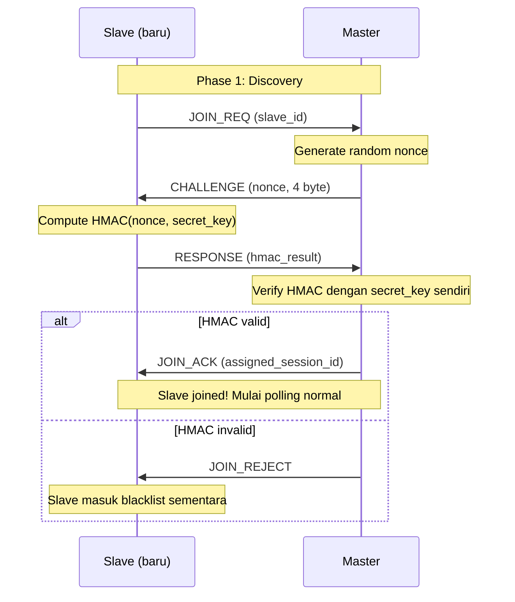

# 📖 OUTLINE BUKU PANDUAN (REVISI TERSTRUKTUR)

## Judul Lengkap

**Komunikasi LoRa Multi-Node dengan Arduino Uno & Dragino Shield**
*Dari Polling Sederhana hingga Jaringan Sensor Terotentikasi — Pendekatan Layered Protocol*

---

## Filosofi Penulisan

Buku ini ditulis dengan empat prinsip utama:

1. **Problem-Driven Progression** — setiap bab muncul karena ada masalah konkret di bab sebelumnya. Mahasiswa tidak belajar fitur secara terpisah, tetapi melihat *kenapa* fitur itu perlu ada.
2. **Layered Architecture sebagai Benang Merah** — pembaca diperkenalkan model layer komunikasi sejak Bab 3, lalu setiap bab mengisi satu layer. Di akhir buku mereka punya stack komunikasi LoRa yang utuh, bukan sekadar kumpulan demo.
3. **Research-Grade Sejak Awal** — setiap bab teknis disertai bagian *Eksperimen yang Bisa Dikerjakan* yang mencakup variabel kontrol, hipotesis, metode pengukuran, dan format pelaporan. Ini langsung jadi bahan tugas akhir / mini-paper.
4. **Heterogen Sejak Multi-Node** — sensor heterogen (jumlah berbeda per slave) diperkenalkan sejak Bagian 3, bukan sebagai add-on di akhir, supaya mahasiswa merasakan masalah protokol sejak awal.

---

## Target Pembaca

- Mahasiswa S1/D4 teknik elektro & informatika (semester 5+)
- Mahasiswa S2 yang butuh foundation komunikasi nirkabel untuk topik thesis
- Hobiis IoT dan embedded systems
- Peneliti yang butuh framework eksperimen komunikasi LoRa

## Prasyarat

- Dasar Arduino (digitalRead/Write, Serial.print, void setup/loop)
- Dasar C/C++: tipe data, fungsi, struct
- Pemahaman bilangan biner & heksadesimal (untuk Bagian 4 dan 6)

## Level Kesulitan

```
Bagian 1-2: Pemula      (sudah tahu Arduino dasar)
Bagian 3-4: Menengah    (mulai bicara protokol & frame)
Bagian 5-6: Lanjutan    (network & security)
Bagian 7  : Capstone    (integrasi & metodologi research)
```

---

## Statistik Buku

| Bagian | Tema | Jumlah Bab | Estimasi Halaman |
|---|---|---|---|
| Bagian 1 | Foundation | 3 | ~36 |
| Bagian 2 | Physical & Link Layer | 3 | ~45 |
| Bagian 3 | Payload & Protocol Design | 3 | ~50 |
| Bagian 4 | Reliable Transport | 3 | ~42 |
| Bagian 5 | Network Formation | 3 | ~38 |
| Bagian 6 | Security | 3 | ~42 |
| Bagian 7 | Capstone & Research | 3 | ~38 |
| Lampiran | A-E | 5 | ~25 |
| **TOTAL** | | **21 bab** | **~316 halaman** |

---

# BAGIAN 1 — FOUNDATION

> *Tujuan bagian: pembaca paham apa itu LoRa, hardware yang dipakai, dan kerangka konseptual (layered model) yang akan dipakai sepanjang buku.*

## Bab 1 — Pengantar LoRa dan SX1276

| Sub-bab | Halaman | Poin Penting |
|---|---|---|
| 1.1 Apa itu LoRa? | 4 | Chirp Spread Spectrum, jangkauan vs bandwidth |
| 1.2 LoRa vs WiFi, BLE, ZigBee, NB-IoT | 3 | Tabel jarak, datarate, daya, biaya |
| 1.3 Arsitektur SX1276 | 5 | FIFO, IRQ, PA, LNA, register map |
| 1.4 Mode Operasi | 4 | Sleep, Standby, FSTX/FSRX, TX, RX, CAD |
| 1.5 Parameter LoRa | 6 | SF, BW, CR, preamble — hubungan dengan airtime & sensitivitas |

## Bab 2 — Hardware Dragino LoRa Shield v1.2

| Sub-bab | Halaman | Poin Penting |
|---|---|---|
| 2.1 Pin Mapping dan Jumper | 4 | R9→D10, DIO0→D2, RST→D9, foto board |
| 2.2 Antena dan Impedansi | 3 | 50Ω, SMA vs uFL, **bahaya TX tanpa antena** |
| 2.3 Power Management | 3 | 3.3V vs 5V, konsumsi TX 120mA vs RX 11mA |
| 2.4 LED Indikator | 2 | D13 sharing dengan SPI SCK — interpretasi kedipan |

## Bab 3 — Instalasi, Persiapan, dan Model Komunikasi

| Sub-bab | Halaman | Poin Penting |
|---|---|---|
| 3.1 Install Arduino IDE & arduino-cli | 2 | Cross-platform |
| 3.2 Install Library LoRa (sandeepmistry) | 2 | `arduino-cli lib install "LoRa"` |
| 3.3 Verifikasi Shield | 3 | Program test `LoRa.begin()`, deteksi shield |
| 3.4 Mengenal COM Port | 2 | Windows vs Linux vs Mac |
| **3.5 Layered Communication Model** ⭐ | 6 | **Bab krusial**: OSI 7-layer → mapping ke buku ini |

### Diagram Layered Architecture (akan dipakai sebagai navigasi sepanjang buku)

```
┌─────────────────────────────────────────┐
│  Layer 5: Application                   │  ← Bab 19 (capstone)
│   (sensor reading, business logic)      │
├─────────────────────────────────────────┤
│  Layer 4: Security                      │  ← Bagian 6
│   (auth, encryption, replay-protect)    │
├─────────────────────────────────────────┤
│  Layer 3: Network                       │  ← Bagian 5
│   (addressing, discovery, registration) │
├─────────────────────────────────────────┤
│  Layer 2: Transport / Reliability       │  ← Bagian 4
│   (ACK, retransmit, sequence number)    │
├─────────────────────────────────────────┤
│  Layer 1: Data Link / Frame             │  ← Bagian 3-4
│   (payload format, CRC/FCS)             │
├─────────────────────────────────────────┤
│  Layer 0: Physical                      │  ← Bagian 2
│   (LoRa modulation, SF/BW/CR)           │
└─────────────────────────────────────────┘
```

**Kode Program Bagian 1:**
- `00-lora-hello.ino` — Inisialisasi LoRa + cetak parameter ke Serial (verifikasi shield)

---

# BAGIAN 2 — PHYSICAL & LINK LAYER FUNDAMENTALS

> *Tujuan: pembaca menguasai TX/RX dasar, paham collision, dan bisa mengimplementasi polling 3-node. Di akhir bagian, mahasiswa mulai merasakan "kalau datanya sungguhan, gimana?" — jembatan ke Bagian 3.*

## Bab 4 — Single Link: Sender ↔ Receiver

| Sub-bab | Halaman | Poin Penting |
|---|---|---|
| 4.1 Inisialisasi LoRa | 4 | `LoRa.begin()`, `setPins()`, parameter wajib |
| 4.2 TX — Mengirim Data | 5 | `beginPacket()` / `print()` / `endPacket()` blocking |
| 4.3 RX — Menerima Data | 5 | `parsePacket()`, `available()`, `read()`, RSSI/SNR |
| 4.4 Program Lengkap dengan Penjelasan Baris-per-Baris | 6 | Tampilkan kode dengan anotasi pedagogis |
| **4.5 Eksperimen Research: PDR vs Jarak** ⭐ | 4 | Eksperimen pertama dengan metodologi |

### 🧪 Eksperimen 4.5 — PDR vs Jarak

**Tujuan:** Mengukur Packet Delivery Ratio (PDR) sebagai fungsi jarak antar node.

**Hipotesis (H1):** PDR menurun secara monoton terhadap jarak, dengan penurunan tajam (knee) di sekitar batas link budget.

**Variabel:**
- Independen: jarak antar node (5m, 10m, 25m, 50m, 100m, 200m)
- Dependen: PDR (%), RSSI rata-rata (dBm), SNR rata-rata (dB)
- Kontrol: SF=7, BW=125kHz, CR=4/5, TX power=17dBm, payload=32 byte, **lingkungan sama**, **antena sama**

**Metode Ukur:**
- Sender kirim 100 paket dengan sequence number (1..100), interval 200 ms
- Receiver hitung paket yang diterima, catat RSSI & SNR per paket
- `PDR = (paket_diterima / 100) × 100%`
- Ulangi 3 kali per titik jarak (untuk standard deviation)

**Format Pelaporan:**
- Tabel: jarak | PDR_mean | PDR_stddev | RSSI_mean | SNR_mean
- Grafik: PDR vs jarak (line plot dengan error bar)
- Diskusi: identifikasi titik "knee", bandingkan dengan link budget teoritis

**Kode Program:**
- `01-sender-pdr.ino` — kirim 100 paket dengan seq number
- `01-receiver-pdr.ino` — receiver dengan logger CSV via Serial

## Bab 5 — Peer-to-Peer 2 Node

| Sub-bab | Halaman | Poin Penting |
|---|---|---|
| 5.1 Topologi Peer-to-Peer | 3 | Simetris, tidak ada master |
| 5.2 Masalah Collision | 4 | Demonstrasi tabrakan dengan dua node TX bersamaan |
| 5.3 Simple ALOHA & Slotted ALOHA | 5 | Random backoff, throughput teoritis |
| 5.4 Implementasi 2-Way Communication | 6 | Button-triggered TX, LED notifikasi RX |
| **5.5 Eksperimen Research: Collision Rate vs Beban** ⭐ | 4 | |

### 🧪 Eksperimen 5.5 — Collision Rate vs Beban Lalu Lintas

**Tujuan:** Mengukur tingkat collision pada peer-to-peer tanpa coordinator sebagai fungsi rate transmisi.

**Hipotesis (H1):** Collision rate naik secara non-linear terhadap rate transmisi, dengan knee point sekitar saat duty cycle gabungan = 50%.

**Variabel:**
- Independen: TX rate per node (1, 2, 5, 10, 20 paket/detik)
- Dependen: PDR, jumlah collision yang terdeteksi (CRC error)
- Kontrol: SF=7, BW=125kHz, jarak 5m, payload 16 byte

**Metode Ukur:**
- Dua node TX bersamaan dengan rate berbeda
- Receiver ketiga (passive observer) di tengah, hitung paket valid vs CRC error
- Plot: collision rate vs aggregate offered load

**Kode Program:**
- `02-peer-nodeA.ino`, `02-peer-nodeB.ino` — TX rate configurable
- `02-observer.ino` — passive listener dengan CRC counter

## Bab 6 — Master-Slave Polling 3-Node ⭐ (Anchor Chapter)

| Sub-bab | Halaman | Poin Penting |
|---|---|---|
| 6.1 Mengapa Master-Slave? | 3 | Solusi untuk collision Bab 5 |
| 6.2 Round-Robin Polling dengan Time Slicing | 4 | Algoritma giliran, slot 500ms |
| 6.3 Addressing Sederhana dan ID | 3 | `POLL:N`, slave filter by ID |
| 6.4 Timeout Handling | 4 | Mendeteksi slave mati tanpa blocking |
| 6.5 Program Lengkap 3-Node | 8 | master.ino, slave1.ino, slave2.ino — anotasi |
| 6.6 Analisis Timing & Airtime | 4 | Hitung airtime SF7, durasi cycle ideal |
| **6.7 Keterbatasan: Mengapa Kode Ini Belum Production-Ready** ⭐ | 3 | **Pengantar ke Bagian 3-4** |

### 6.7 — Daftar Keterbatasan yang Dialami (Jembatan ke Bagian 3)

| Keterbatasan | Akan Diselesaikan di |
|---|---|
| Hanya kirim data dummy (counter) — bagaimana kalau sensor sungguhan? | Bab 7-8 |
| Tidak ada deteksi error — bagaimana kalau payload korup di udara? | Bab 9 |
| Master tidak tahu slave hidup atau mati, hanya FAIL | Bab 10 |
| Slave harus pre-configured manual — bagaimana kalau jumlah node bertambah? | Bab 14 |
| Siapa saja bisa kirim `POLL:1` — bagaimana keamanannya? | Bab 16-19 |

**Kode Program:**
- `03-master.ino`, `03-slave1.ino`, `03-slave2.ino` — versi yang sudah ada

---

# BAGIAN 3 — PAYLOAD & PROTOCOL DESIGN

> *Tujuan: dari data dummy ke data sensor heterogen yang real. Mahasiswa belajar merancang protokol payload — keputusan desain yang bertahan seumur hidup proyek.*

## Bab 7 — Designing Application Payload

| Sub-bab | Halaman | Poin Penting |
|---|---|---|
| 7.1 Dari Dummy ke Data Nyata | 4 | Apa beda counter vs sensor reading |
| 7.2 Sensor Heterogen per Slave | 5 | **Slave 1: DHT22 + BMP280 (2 sensor) <br> Slave 2: DHT22 + BMP280 + MQ-2 + LDR (4 sensor)** |
| 7.3 Format Payload: 3 Pilihan | 8 | **CSV**: `S1,T=25.3,H=60.2` <br> **JSON**: `{"id":1,"t":25.3,"h":60.2}` <br> **Binary packed**: 16-bit fixed-point, 8 byte total |
| 7.4 Trade-off: Ukuran vs Readability vs Portabilitas | 5 | Tabel komparasi airtime untuk masing-masing format |
| **7.5 Eksperimen Research: Throughput per Format** ⭐ | 4 | |

### 7.3 — Trade-off Format Payload

| Aspek | CSV | JSON | Binary Packed |
|---|---|---|---|
| Ukuran 4 sensor | ~32 byte | ~80 byte | 8 byte |
| Airtime SF7 | ~62 ms | ~95 ms | ~36 ms |
| Human readable | ✅ | ✅ | ❌ |
| Parsing complexity | Sedang | Tinggi | Rendah |
| Schema evolution | Sulit | Mudah | Sangat sulit |
| Rekomendasi | Edukasi & debug | Prototype | Production |

### 🧪 Eksperimen 7.5 — Throughput per Format Payload

**Tujuan:** Mengukur throughput sistem (paket/detik) untuk 3 format payload.

**Hipotesis:** Binary packed memberikan throughput 2.5-3× CSV, dan 4-5× JSON, karena airtime lebih singkat.

**Variabel:**
- Independen: format payload (CSV, JSON, binary)
- Dependen: throughput (paket/detik), cycle time (ms)
- Kontrol: SF7, BW125, jumlah sensor sama (4 sensor di Slave 2)

**Metode Ukur:**
- Jalankan polling 1000 cycle untuk masing-masing format
- Catat total durasi, hitung paket sukses per detik
- Plot bar chart komparasi

**Kode Program:**
- `04-slave1-csv.ino`, `04-slave1-json.ino`, `04-slave1-binary.ino`
- `04-slave2-csv.ino`, `04-slave2-json.ino`, `04-slave2-binary.ino`
- `04-master-multi-format.ino` — master yang bisa parse ketiga format

## Bab 8 — Generic Slave Architecture

| Sub-bab | Halaman | Poin Penting |
|---|---|---|
| 8.1 Mengapa Slave Generic? | 3 | Scalability, maintenance, kode kembar |
| 8.2 Konfigurasi via `#define` dan struct | 5 | `SLAVE_ID`, `SENSOR_COUNT`, `SensorInfo[]` |
| 8.3 Sensor Metadata Pattern | 5 | Setiap sensor punya: ID, tipe, unit, range |
| 8.4 Slave Mendeskripsikan Kapabilitasnya | 5 | Master tanya `DESC:N`, slave balas list sensornya |
| **8.5 Eksperimen Research: Code Footprint** ⭐ | 3 | |

### 🧪 Eksperimen 8.5 — Code Footprint Generic vs Hardcoded

**Tujuan:** Membandingkan ukuran kode (Flash + SRAM) antara slave hardcoded vs slave generic.

**Hipotesis:** Generic version 10-20% lebih besar di Flash karena overhead struct, tapi *tidak bertambah* saat jumlah sensor naik.

**Variabel:**
- Independen: jumlah sensor (1, 2, 4, 8)
- Dependen: Flash usage (byte), SRAM usage (byte)
- Kontrol: kompiler version, optimization flag (-Os)

**Metode Ukur:**
- Compile semua versi, catat output `arduino-cli compile --output-dir`
- Plot: jumlah sensor vs flash size — generic harus flat, hardcoded harus linear

**Kode Program:**
- `05-slave-generic.ino` — universal slave berbasis struct
- `05-master-discovery.ino` — master yang tanyakan `DESC:N` di awal

## Bab 9 — Frame Integrity dengan CRC/FCS

| Sub-bab | Halaman | Poin Penting |
|---|---|---|
| 9.1 Teori CRC | 4 | Polynomial division, generator polynomial |
| 9.2 CRC Hardware SX1276 | 4 | Register IRQ_FLAGS, deteksi bit error otomatis |
| 9.3 CRC Software (CRC-16-CCITT) di Application Layer | 5 | Kenapa butuh extra CRC di atas hardware CRC |
| 9.4 Format Frame Final | 4 | `[ID][LEN][PAYLOAD][CRC16]` — frame yang utuh |
| **9.5 Eksperimen Research: PER vs SNR** ⭐ | 4 | |

### 9.4 — Format Frame Final

```
┌──────┬─────┬─────────────────────┬────────────┐
│  ID  │ LEN │      PAYLOAD        │   CRC-16   │
│ 1 B  │ 1 B │   N byte (≤64)      │   2 byte   │
└──────┴─────┴─────────────────────┴────────────┘
   ▲      ▲             ▲                ▲
   │      │             │                └─ CRC-CCITT-16 dari ID+LEN+PAYLOAD
   │      │             └─ Payload aktual (format dari Bab 7)
   │      └─ Panjang payload (tanpa header & CRC)
   └─ ID Slave (1-254, 0=broadcast, 255=master)
```

### 🧪 Eksperimen 9.5 — Packet Error Rate vs SNR

**Tujuan:** Karakterisasi reliability fisik link sebagai fungsi SNR.

**Hipotesis:** PER ≤ 1% saat SNR ≥ -7 dB (sesuai datasheet SX1276 SF7), naik tajam di SNR < -10 dB.

**Variabel:**
- Independen: SNR (variasi dengan menjauhkan node atau menambah attenuator)
- Dependen: PER (% paket dengan CRC error)
- Kontrol: SF7, BW125, CR4/5, payload 32 byte

**Metode Ukur:**
- Sender kirim 1000 paket dengan CRC software
- Receiver hitung: total RX, CRC pass, CRC fail
- `PER = CRC_fail / total_RX × 100%`
- Ulangi di 5 titik SNR berbeda

**Format Pelaporan:**
- Tabel SNR vs PER dengan confidence interval
- Grafik PER vs SNR (log scale di Y)
- Bandingkan dengan kurva teoritis SX1276 datasheet

**Kode Program:**
- `06-frame-builder.ino` — library helper untuk build/parse frame
- `06-sender-frame.ino`, `06-receiver-frame.ino`
- `06-per-stats.ino` — receiver yang track CRC pass/fail stats

---

# BAGIAN 4 — RELIABLE TRANSPORT

> *Tujuan: dari "kirim dan harap sampai" ke "kirim dan pastikan sampai". Mahasiswa belajar ACK, retransmit, dan cara mengukur kualitas link.*

## Bab 10 — ACK & Retransmission

| Sub-bab | Halaman | Poin Penting |
|---|---|---|
| 10.1 Jenis ACK | 3 | Empty ACK, piggyback ACK, status ACK |
| 10.2 Sequence Number untuk Duplicate Detection | 5 | Wrap-around handling, 8-bit vs 16-bit |
| 10.3 Implementasi ACK Eksplisit | 6 | Master: POLL → Slave: DATA+SEQ → Master: ACK |
| 10.4 Retransmission Strategy | 5 | Max 3 retry, exponential backoff (100ms, 200ms, 400ms) |
| **10.5 Eksperimen Research: Goodput vs Retry Limit** ⭐ | 4 | |

### 🧪 Eksperimen 10.5 — Goodput vs Retry Limit

**Tujuan:** Menentukan jumlah retry optimal yang memaksimalkan goodput.

**Hipotesis:** Goodput naik dari retry=0 ke retry=2, kemudian plateau atau turun di retry≥4 karena overhead retransmit melebihi keuntungan delivery.

**Variabel:**
- Independen: max retry (0, 1, 2, 3, 5)
- Dependen: goodput (data byte sukses / detik), latency p95 (ms)
- Kontrol: link quality fixed (atur jarak supaya PER ≈ 20%)

**Metode Ukur:**
- Jalankan 500 cycle per konfigurasi retry
- Catat: total data sukses (byte), total durasi, distribusi latency
- Plot: retry vs goodput (line plot), retry vs latency p50/p95/p99

**Kode Program:**
- `07-master-ack.ino` — master dengan retry logic
- `07-slave-ack.ino` — slave yang kirim ACK + handle duplikat (seq number check)

## Bab 11 — Adaptive Timeout & QoS

| Sub-bab | Halaman | Poin Penting |
|---|---|---|
| 11.1 Timeout Tetap vs Adaptif | 4 | Single timeout bikin slow nodes timeout terus |
| 11.2 RTT Estimation (mirip TCP) | 5 | `EstimatedRTT = α × NewRTT + (1-α) × OldRTT` |
| 11.3 Prioritas Data: Normal vs Alarm | 5 | Alarm packet pakai slot tetap, bypass scheduler |
| 11.4 Implementasi QoS Sederhana | 4 | Flag `PRIORITY` di frame header |
| **11.5 Eksperimen Research: Latency Alarm vs Normal** ⭐ | 4 | |

### 🧪 Eksperimen 11.5 — Latency Alarm vs Normal Traffic

**Tujuan:** Memverifikasi bahwa priority flag betul-betul mengurangi latency untuk alarm packet.

**Hipotesis:** Latency p95 alarm < 0.5× latency p95 normal dalam jaringan dengan 5 slave aktif.

**Variabel:**
- Independen: tipe traffic (normal-only, alarm-occasional, alarm-frequent)
- Dependen: latency end-to-end p50, p95, p99
- Kontrol: 5 slave aktif, payload sama, link quality stabil

**Metode Ukur:**
- 5 slave kirim data normal, 1 slave kadang-kadang inject alarm
- Master timestamp saat RX, hitung latency
- Plot CDF latency: normal vs alarm

**Kode Program:**
- `08-master-qos.ino`, `08-slave-qos.ino` — dengan priority flag

## Bab 12 — Performance Evaluation Framework

| Sub-bab | Halaman | Poin Penting |
|---|---|---|
| 12.1 Metrik Standar Komunikasi Nirkabel | 5 | PDR, PER, throughput, goodput, latency CDF |
| 12.2 Mengukur dengan Benar | 4 | Confidence interval, warm-up period, ulangi eksperimen |
| 12.3 Tools: Python Dashboard untuk Real-Time Monitoring | 5 | **Sudah dibuat: `lora_monitor.py`** |
| 12.4 Logging & CSV Export | 3 | Format standar untuk analisis pandas/Excel |
| 12.5 Visualisasi Hasil | 4 | Matplotlib snippets untuk PDR vs jarak, CDF latency |
| **12.6 Template Pelaporan Eksperimen** | 3 | Format mini-paper untuk laporan praktikum |

### 12.6 — Template Pelaporan Eksperimen

```
1. Judul Eksperimen
2. Tujuan (1 kalimat)
3. Hipotesis (testable, falsifiable)
4. Setup
   - Hardware (board, jarak, antena)
   - Parameter LoRa (SF, BW, CR, TX power)
   - Variabel kontrol vs variabel uji
5. Metode Pengukuran
6. Hasil (tabel + grafik)
7. Diskusi (apakah hipotesis dikonfirmasi?)
8. Keterbatasan
9. Future Work
```

**Kode Program:**
- `lora_monitor.py` — Python dashboard (sudah ada)
- `09-csv-analyzer.py` — script analisis pandas untuk CSV output
- `09-plotter.py` — auto-plot PDR/PER/latency dari CSV

---

# BAGIAN 5 — NETWORK FORMATION

> *Tujuan: dari konfigurasi statis ke jaringan dinamis. Mahasiswa belajar discovery, registration, dan mengapa topologi bisa berubah.*

## Bab 13 — Static Topology dengan Pre-Configured List

| Sub-bab | Halaman | Poin Penting |
|---|---|---|
| 13.1 Network ID untuk Memisahkan Jaringan | 4 | NETID 1 byte, filter di slave |
| 13.2 Static Slave Whitelist di Master | 4 | Array `uint8_t allowed_slaves[]` |
| 13.3 Network Map Visualization | 4 | Print topologi via Serial |
| **13.4 Eksperimen Research: Multi-Network Coexistence** ⭐ | 4 | |

### 🧪 Eksperimen 13.4 — Multi-Network Coexistence di Frekuensi Sama

**Tujuan:** Memastikan dua jaringan dengan NETID berbeda tidak saling mengganggu di frekuensi sama.

**Hipotesis:** Cross-network interference < 5% saat NETID berbeda, namun shared airtime tetap menyebabkan throughput per jaringan menurun.

**Variabel:**
- Independen: jumlah jaringan aktif simultan (1, 2)
- Dependen: throughput per jaringan, false-accept rate (paket NETID lain yang terbaca)
- Kontrol: frekuensi sama, SF/BW sama, jarak antar jaringan ~10m

**Kode Program:**
- `10-master-netid.ino`, `10-slave-netid.ino` — dengan NETID filtering
- `10-whitelist.ino` — master yang reject slave di luar daftar

## Bab 14 — Dynamic Discovery (Open Auto-Join)

| Sub-bab | Halaman | Poin Penting |
|---|---|---|
| 14.1 Mengapa Static Topology Tidak Cukup | 3 | Skala besar, slave berganti, deployment lapangan |
| 14.2 Two Patterns: Slave-Advertise vs Master-Beacon | 5 | Trade-off battery, latency, complexity |
| 14.3 Implementasi Slave-Advertise | 6 | Slave broadcast `HELLO:id`, master add ke active list |
| 14.4 Lease & Heartbeat | 5 | Slave kirim heartbeat tiap N detik, master expire setelah 3 miss |
| **14.5 Eksperimen Research: Join Time vs Network Size** ⭐ | 3 | |

### 14.2 — Trade-off: Slave-Advertise vs Master-Beacon

| Aspek | Slave-Advertise | Master-Beacon |
|---|---|---|
| Cara kerja | Slave broadcast HELLO saat hidup | Master broadcast BEACON periodik, slave reply |
| Battery slave | Boros (TX = mahal) | Hemat (hanya RX) |
| Latency join | Cepat (langsung join) | Lambat (tunggu beacon berikutnya) |
| Collision risk | Tinggi (banyak HELLO bersamaan) | Rendah (master coordinated) |
| Cocok untuk | Sensor on-demand wake-up | Battery-powered IoT |

### 🧪 Eksperimen 14.5 — Join Time vs Network Size

**Tujuan:** Mengukur waktu join sebagai fungsi jumlah slave existing.

**Hipotesis:** Join time naik linear dengan jumlah slave karena master cycle time bertambah.

**Variabel:**
- Independen: jumlah slave existing (0, 2, 5, 10)
- Dependen: waktu antara slave baru power-on sampai pertama kali dipoll
- Kontrol: SF7, payload sama

**Kode Program:**
- `11-master-discovery.ino` — master dengan dynamic active list
- `11-slave-advertise.ino` — slave yang broadcast HELLO + heartbeat

## Bab 15 — Registration & Authentication (Challenge-Response Join)

| Sub-bab | Halaman | Poin Penting |
|---|---|---|
| 15.1 Mengapa Open Auto-Join Berbahaya | 4 | Spoofing demo: hacker fake jadi slave |
| 15.2 Pre-Shared Key Approach | 4 | Master & slave punya secret key sama |
| 15.3 Challenge-Response Handshake | 6 | JOIN_REQ → CHALLENGE(nonce) → RESPONSE(HMAC(nonce,key)) |
| 15.4 Implementasi HMAC-SHA1 Sederhana | 5 | Library `Crypto.h` untuk AVR |
| **15.5 Eksperimen Research: Spoofing Attack Resistance** ⭐ | 4 | |

### 15.3 — Diagram Handshake Challenge-Response



### 🧪 Eksperimen 15.5 — Spoofing Attack Resistance

**Tujuan:** Verifikasi bahwa skema challenge-response menahan spoofing dasar.

**Hipotesis:** Attacker tanpa secret key memiliki probability sukses join < 1/2^32 (asumsi HMAC 32-bit truncated).

**Variabel:**
- Independen: serangan (random response, replay capture, brute force 1000 attempts)
- Dependen: success rate join
- Kontrol: master dengan key tetap, attacker tanpa key

**Metode Ukur:**
- Buat 3 node "attacker": kirim random response, replay HMAC lama, kirim HMAC brute force
- Catat: berapa kali master menerima

**Kode Program:**
- `12-master-auth.ino` — master dengan challenge-response
- `12-slave-auth.ino` — slave dengan HMAC compute
- `12-attacker.ino` — node attacker untuk eksperimen

---

# BAGIAN 6 — SECURITY

> *Tujuan: melindungi link yang sudah reliable dari ancaman aktif. Threat model dulu, baru defense.*

## Bab 16 — Threat Model untuk LoRa

| Sub-bab | Halaman | Poin Penting |
|---|---|---|
| 16.1 Snooping (Eavesdropping) | 3 | Semua orang di frekuensi sama bisa dengar |
| 16.2 Spoofing | 4 | Hacker pura-pura jadi node valid (sudah dilawan di Bab 15) |
| 16.3 Replay Attack | 5 | Rekam paket valid, kirim ulang nanti |
| 16.4 Jamming (DoS) | 4 | Kirim noise di frekuensi sama |
| **16.5 Demo: Sniffing dengan Node Ketiga** ⭐ | 3 | Eksperimen pasif yang sah untuk edukasi |

### 🧪 Eksperimen 16.5 — Passive Sniffing Demo

**Tujuan:** Mendemonstrasikan bahwa komunikasi LoRa unencrypted bisa di-sniff dengan node ketiga.

**Etika:** Hanya pakai jaringan sendiri, jangan sniff jaringan orang lain.

**Setup:**
- 1 master + 1 slave (normal communication)
- 1 attacker node yang `LoRa.receive()` tapi tidak pernah TX
- Attacker print semua paket ke Serial

**Hasil yang diharapkan:** Attacker dapat baca semua payload (sensor reading, ID, dll) tanpa kesulitan.

**Kode Program:**
- `13-sniffer.ino` — passive listener

## Bab 17 — Replay Protection

| Sub-bab | Halaman | Poin Penting |
|---|---|---|
| 17.1 Konsep Rolling Code | 4 | Counter yang naik tiap pesan |
| 17.2 Implementasi XOR-based Rolling Code | 5 | `hash = counter XOR secret` |
| 17.3 Timestamp-Based Replay Protection | 5 | Window ±N detik, reject pesan di luar window |
| 17.4 Sinkronisasi Counter setelah Restart | 4 | Save ke EEPROM, atau resync handshake |
| **17.5 Eksperimen Research: Replay Window Trade-off** ⭐ | 3 | |

### 🧪 Eksperimen 17.5 — Replay Window Trade-off

**Tujuan:** Mengevaluasi trade-off antara replay protection (window kecil) vs clock drift tolerance (window besar).

**Hipotesis:** Window ≥ 30 detik menyebabkan replay attack tetap berhasil jika dikirim cepat. Window ≤ 1 detik menyebabkan false rejection karena clock drift.

**Variabel:**
- Independen: replay window (0.5, 1, 5, 30 detik)
- Dependen: replay success rate, false rejection rate (legitimate packet ditolak)

**Kode Program:**
- `14-master-replay.ino`, `14-slave-replay.ino` — dengan timestamp + counter
- `14-attacker-replay.ino` — replay attack tool

## Bab 18 — Confidentiality dengan Enkripsi

| Sub-bab | Halaman | Poin Penting |
|---|---|---|
| 18.1 XOR Cipher (Pedagogis) | 4 | Sederhana, demonstratif, tapi tidak aman |
| 18.2 AES-128 di AVR | 5 | Library `AESLib`, block 16 byte |
| 18.3 ECB vs CBC: Mengapa CBC Lebih Aman | 5 | Demo ECB pattern leak |
| 18.4 Integrasi Enkripsi ke Frame | 4 | Encrypt(payload) ∥ CRC(encrypted) |
| **18.5 Eksperimen Research: Encryption Overhead** ⭐ | 3 | |

### 🧪 Eksperimen 18.5 — Encryption Overhead

**Tujuan:** Mengukur overhead enkripsi terhadap throughput dan CPU time.

**Hipotesis:** AES-128 menambah <5 ms processing time per paket di AVR @ 16MHz, tapi mengurangi throughput karena padding ke kelipatan 16 byte.

**Variabel:**
- Independen: skema (no encryption, XOR, AES-ECB, AES-CBC)
- Dependen: encryption time (μs), end-to-end throughput, payload overhead (%)

**Kode Program:**
- `15-master-xor.ino`, `15-slave-xor.ino`
- `15-master-aes.ino`, `15-slave-aes.ino`

---

# BAGIAN 7 — CAPSTONE & RESEARCH

> *Tujuan: integrasi semua bab sebelumnya menjadi satu sistem utuh, plus metodologi untuk membawanya ke level research.*

## Bab 19 — Capstone: Sistem Monitoring Sensor Lengkap

| Sub-bab | Halaman | Poin Penting |
|---|---|---|
| 19.1 Spesifikasi Sistem | 4 | 1 master + 3 slave heterogen + dashboard PC |
| 19.2 Integrasi Semua Layer | 6 | Frame Bab 9 + ACK Bab 10 + Discovery Bab 14 + Auth Bab 15 + Enkripsi Bab 18 |
| 19.3 State Machine Master Final | 5 | Boot → Discovery phase → Polling phase → Maintenance |
| 19.4 State Machine Slave Final | 4 | Boot → Join (auth) → Active (poll/respond) → Sleep |
| 19.5 Dashboard PC Live Monitoring | 4 | Extend `lora_monitor.py` untuk frame baru |
| 19.6 Field Test & Deployment | 4 | Checklist lapangan, troubleshooting nyata |

### 19.1 — Spesifikasi Sistem Capstone

| Node | Sensor | Format | Update Rate |
|---|---|---|---|
| Slave 1 (Outdoor) | DHT22, BMP280 | Binary packed, encrypted | 1× per 5 detik |
| Slave 2 (Indoor) | DHT22, BMP280, MQ-2, LDR | Binary packed, encrypted | 1× per 5 detik |
| Slave 3 (Mobile/Alarm) | DHT22, PIR, Buzzer | Binary packed, **priority** | On-event |

**Kode Program:**
- `final-master.ino` (~600 lines, fully commented)
- `final-slave1.ino`, `final-slave2.ino`, `final-slave3.ino`
- `final-dashboard.py` — extension dari lora_monitor.py

## Bab 20 — Performance Comparison Study

| Sub-bab | Halaman | Poin Penting |
|---|---|---|
| 20.1 Eksperimen Komparatif: SF7 vs SF9 vs SF12 | 4 | Range vs throughput trade-off |
| 20.2 Bandwidth Trade-off: 125 vs 250 vs 500 kHz | 3 | Sensitivitas vs datarate |
| 20.3 Payload Size Optimization | 3 | Sweet spot untuk batch reading |
| 20.4 Energy per Bit Measurement | 4 | Joule per bit untuk tiap konfigurasi |
| 20.5 Menulis Mini-Paper dari Hasil Eksperimen | 4 | Struktur paper IEEE/ACM mini |

### 🧪 Eksperimen Komprehensif Bab 20

Bab ini adalah **bab metodologi research**. Berisi 4 eksperimen komparatif yang masing-masing menghasilkan paper-quality data:

1. **Range vs SF**: ukur jangkauan max untuk PDR≥90% di SF7..SF12
2. **Sensitivity vs BW**: ukur RSSI minimum untuk SNR>5dB di tiap BW
3. **Payload sweet spot**: variasi ukuran payload (8, 16, 32, 64, 128 byte), ukur efficiency
4. **Energy per bit**: ukur arus rata-rata × tegangan × waktu, bagi dengan jumlah bit terkirim

**Kode Program:**
- `20-experiment-framework.ino` — slave yang configurable via parameter
- `20-power-meter-hook.py` — interface ke INA219 untuk pengukuran arus

## Bab 21 — Open Research Problems & Future Work

| Sub-bab | Halaman | Poin Penting |
|---|---|---|
| 21.1 Gateway-to-Cloud Architecture | 4 | ESP32 sebagai gateway, MQTT ke cloud |
| 21.2 LoRaWAN: Mengapa & Kapan? | 4 | Perbedaan dengan custom protocol di buku ini |
| 21.3 LoRa Mesh: Multi-Hop | 4 | Topologi mesh, routing protocols (RPL, AODV) |
| 21.4 Machine Learning di Edge LoRa | 3 | Anomaly detection di slave, kirim hasil bukan raw |
| 21.5 Topik untuk Thesis & Skripsi | 5 | 10 ide thesis konkret berbasis buku ini |

### 21.5 — 10 Ide Thesis Konkret

1. **Adaptive SF Selection** berdasarkan RSSI real-time (channel quality adaptation)
2. **Multi-channel Frequency Hopping** untuk anti-jamming
3. **Energy-aware Polling Scheduler** dengan battery state reporting
4. **LoRa Mesh dengan AODV-light** untuk multi-hop coverage extension
5. **Anomaly Detection** lokal di slave dengan TinyML
6. **Compressed Sensing** untuk reduce payload sambil maintain accuracy
7. **Forward Error Correction** custom di atas LoRa CR
8. **Geolocation tanpa GPS** menggunakan RSSI fingerprinting
9. **Federated Learning** lewat LoRa untuk edge sensor network
10. **Secure Firmware Update Over-The-Air (FOTA)** lewat LoRa dengan signature verification

---

# LAMPIRAN

## Lampiran A — Tabel Referensi Cepat

| Isi | Halaman |
|---|---|
| A.1 Pin Mapping Dragino Shield | 1 |
| A.2 Tabel Airtime (SF7-SF12 × BW125/250/500) | 2 |
| A.3 Kode Error dan Solusi | 1 |
| A.4 Perintah arduino-cli untuk Upload | 1 |
| A.5 Register Map SX1276 yang Sering Dipakai | 2 |

## Lampiran B — Library & Dependencies

| Library | Fungsi | Source |
|---|---|---|
| LoRa (sandeepmistry) | Driver SX1276 | github.com/sandeepmistry/arduino-LoRa |
| Crypto / AESLib | AES-128 | Arduino Library Manager |
| ArduinoJson | JSON parser (opsional, Bab 7) | arduinojson.org |
| pyserial | Python serial | pip install pyserial |
| rich | Dashboard CLI | pip install rich |

## Lampiran C — Glossary Istilah

Daftar istilah dengan definisi singkat: SF, BW, CR, PDR, PER, RSSI, SNR, CRC, FCS, HMAC, ACK, NACK, ECB, CBC, NETID, airtime, duty cycle, dll.

## Lampiran D — Troubleshooting Lengkap

| Masalah | Diagnosis | Solusi |
|---|---|---|
| `LoRa.begin()` gagal | Jumper R9, kabel SPI | Periksa R9 (0Ω), shield seating |
| Tidak terima paket | Antena, parameter | Pasang antena, samakan SF/BW/CR/Freq |
| Upload error | Port terkunci | Tutup Serial Monitor / lora_monitor |
| Data 0 di dashboard | Baud rate mismatch | Sesuaikan baud Python dengan Arduino |
| Slave miss POLL sporadis | Race condition RX setup | Tambah delay 10ms setelah TX di slave |

## Lampiran E — Template Laporan Praktikum ⭐ (BARU)

Template Markdown siap-pakai untuk laporan mahasiswa, dengan struktur:

```
# Laporan Praktikum [Bab X]: [Judul]

## 1. Identitas
Nama: __________
NIM:  __________
Kelas: __________
Tanggal: __________

## 2. Tujuan Eksperimen
[1-2 kalimat]

## 3. Hipotesis
H1: __________

## 4. Setup Eksperimen
### 4.1 Hardware
- Board: ...
- Antena: ...
- Jarak/lokasi: ...

### 4.2 Parameter LoRa
| SF | BW | CR | TX Power | Payload Size |
|---|---|---|---|---|
| 7 | 125kHz | 4/5 | 17dBm | 32 byte |

### 4.3 Variabel
- Kontrol: ...
- Independen: ...
- Dependen: ...

## 5. Metode Pengukuran
[Langkah-langkah]

## 6. Hasil
### 6.1 Tabel Data Mentah
[Tabel CSV]

### 6.2 Grafik
[Plot dengan caption]

### 6.3 Statistik
- Mean: ...
- Std dev: ...
- 95% CI: ...

## 7. Diskusi
- Apakah hipotesis dikonfirmasi?
- Penyimpangan dari ekspektasi
- Faktor yang tidak terkontrol

## 8. Keterbatasan
[Daftar limitasi]

## 9. Kesimpulan
[2-3 kalimat]

## 10. Future Work
[1-2 ide perbaikan]

## Lampiran
- A. Raw data CSV
- B. Foto setup
- C. Source code yang dimodifikasi
```

---

# 📊 RINGKASAN PROGRAM YANG PERLU DIBUAT

## Sudah Ada
| File | Bab | Status |
|---|---|---|
| `master.ino`, `slave1.ino`, `slave2.ino` | 6 | ✅ Sudah ada (sudah di-update) |
| `lora_monitor.py` | 12 | ✅ Sudah ada |

## Perlu Dibuat (Diurutkan Prioritas)

### Prioritas Tinggi (Mendukung 6 bab inti)
| File | Bab | Catatan |
|---|---|---|
| `01-sender-pdr.ino`, `01-receiver-pdr.ino` | 4 | Basis ukur PDR |
| `04-slave1-binary.ino`, `04-slave2-binary.ino` | 7 | Sensor heterogen + binary payload |
| `04-master-multi-format.ino` | 7 | Master yang parse multiple format |
| `06-frame-builder.ino` | 9 | Library helper frame ID+LEN+PAYLOAD+CRC |
| `07-master-ack.ino`, `07-slave-ack.ino` | 10 | ACK + retry logic |
| `final-master.ino` + 3 slave files | 19 | Capstone project |

### Prioritas Menengah
| File | Bab |
|---|---|
| `02-peer-*.ino`, `02-observer.ino` | 5 |
| `05-slave-generic.ino`, `05-master-discovery.ino` | 8 |
| `11-master-discovery.ino`, `11-slave-advertise.ino` | 14 |
| `12-master-auth.ino`, `12-slave-auth.ino`, `12-attacker.ino` | 15 |

### Prioritas Rendah
| File | Bab |
|---|---|
| `08-master-qos.ino`, `08-slave-qos.ino` | 11 |
| `13-sniffer.ino` | 16 |
| `14-master-replay.ino`, `14-attacker-replay.ino` | 17 |
| `15-master-aes.ino`, `15-slave-aes.ino` | 18 |
| `20-experiment-framework.ino` | 20 |

**Total file baru: ~30 file `.ino` + 3 file Python**

---

# 💡 ROADMAP PENULISAN (12 Minggu)

| Minggu | Aktivitas |
|---|---|
| 1-2 | Bab 1-3: Foundation + diagram layered model |
| 3-4 | Bab 4-6: Tulis ulang dari materi yang sudah ada + tambah eksperimen PDR |
| 5-6 | **Bab 7-9: Payload + CRC** ← bagian baru, paling banyak ngoding |
| 7-8 | Bab 10-12: ACK + Performance evaluation |
| 9 | Bab 13-15: Network formation + authentication |
| 10 | Bab 16-18: Security (3 bab kompak) |
| 11 | Bab 19-21: Capstone integration + research methodology |
| 12 | Lampiran + proofreading + diagram polish |

---

# 🎯 KEUNGGULAN OUTLINE INI vs OUTLINE LAMA

| Aspek | Outline Lama | Outline Baru |
|---|---|---|
| Total bab | 21 | 21 |
| Sensor heterogen | Hanya di Bab 15 (DHT11 saja) | **Sejak Bab 7**, sensor count berbeda per slave |
| Discovery / Registration | ❌ Tidak ada | **Bab 14-15 dedicated** |
| Frame structure formal | Disebut sambil lalu | **Bab 9 dedicated** |
| Metodologi research | ❌ Tidak ada | **Bab 12 + Bab 20 dedicated, eksperimen di setiap bab teknis** |
| Threat model & demo | Disebut singkat | **Bab 16 dedicated dengan demo sniffing** |
| Template laporan | ❌ Tidak ada | **Lampiran E** |
| Layered architecture | ❌ Tidak diperkenalkan | **Bab 3.5 sebagai benang merah** |
| Topik thesis | ❌ Tidak ada | **Bab 21.5: 10 ide konkret** |

---

# 🏁 PENUTUP OUTLINE

Outline ini dirancang supaya pembaca:
1. **Tidak hanya bisa upload kode**, tapi **paham kenapa** tiap fitur ada
2. **Bisa langsung mulai mini-research** karena tiap bab ada eksperimen formal
3. **Bisa lanjut ke level industri** karena sudah paham frame, ACK, discovery, autentikasi
4. **Punya template laporan** yang bisa langsung dipakai untuk tugas akhir

Buku ini bukan buku LoRa biasa — ini **buku komunikasi nirkabel dengan studi kasus LoRa**. Konsep yang diajarkan (frame, ACK, discovery, threat model) **transferable** ke teknologi nirkabel lain (BLE, WiFi, ZigBee, NB-IoT).
