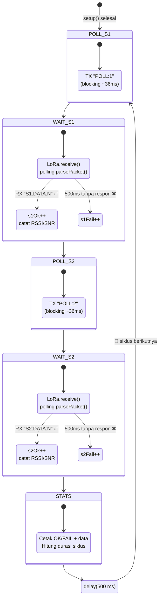

# 05 — LoRa Master-Slave 3 Node (Round-Robin Polling)

> **Target Hardware:** Dragino LoRa Shield v1.2 &nbsp;·&nbsp; MCU: Arduino Uno (ATmega328P) &nbsp;·&nbsp; LoRa: SX1276

[← Kembali ke README Utama](../../README.md)

---

## Daftar Isi

- [Pendahuluan](#pendahuluan)
- [Tujuan Program](#tujuan-program)
- [Hardware yang Digunakan](#hardware-yang-digunakan)
- [Pin Definition](#pin-definition)
- [Struktur File](#struktur-file)
- [Topologi Komunikasi](#topologi-komunikasi)
- [Alur Komunikasi (Communication Flow)](#alur-komunikasi-communication-flow)
- [Cara Kerja Detail](#cara-kerja-detail)
- [Format Payload](#format-payload)
- [Konfigurasi LoRa](#konfigurasi-lora)
- [Analisis Delay & Timing](#analisis-delay--timing)
- [Library yang Digunakan](#library-yang-digunakan)
- [Cara Penggunaan](#cara-penggunaan)
- [Contoh Output Serial Monitor](#contoh-output-serial-monitor)
- [Troubleshooting](#troubleshooting)

---

## Pendahuluan

Subproject `05-master-slave-3node` adalah implementasi komunikasi LoRa **Master-Slave** dengan **3 node** menggunakan metode **round-robin polling**. Ini adalah topologi multi-node paling sederhana dan paling mudah dipelajari.

Terdapat **tiga file terpisah** — satu per board, langsung upload tanpa konfigurasi manual:

| File | Board | Port | Peran |
|---|---|---|---|
| `master.ino` | Arduino Uno + Shield | COM8 | **MASTER** — polling Slave 1 & Slave 2 bergantian |
| `slave1.ino` | Arduino Uno + Shield | COM9 | **SLAVE 1** — merespon hanya jika dipanggil `POLL:1` |
| `slave2.ino` | Arduino Uno + Shield | COM10 | **SLAVE 2** — merespon hanya jika dipanggil `POLL:2` |

Fitur utama:
- **Round-robin polling** — Master memanggil Slave satu per satu, Slave hanya bicara saat dipanggil
- **TX blocking** (`endPacket()`) — andal di AVR, tidak bergantung ISR TX-done
- **RX polling** via `LoRa.parsePacket()` — tidak perlu ISR, bebas race condition, mudah dipahami
- **Timeout per slave** 500 ms — Master mencatat FAIL jika slave tidak merespon
- **Statistik OK/FAIL** — Master melacak keberhasilan setiap slave per siklus

---

## Tujuan Program

- Memperagakan komunikasi LoRa multi-node (3 node) dengan topologi Master-Slave
- Mendemonstrasikan pola round-robin polling yang sederhana dan deterministik
- Menjadi fondasi untuk ekspansi ke lebih banyak node atau pola komunikasi yang lebih kompleks

---

## Hardware yang Digunakan

| Komponen | Detail |
|---|---|
| **Board utama** | Arduino Uno (ATmega328P) |
| **Shield LoRa** | Dragino LoRa Shield v1.2 |
| **Modul LoRa** | SX1276 (onboard shield) |
| **Frekuensi** | **433 MHz** |
| **LED** | LED built-in Arduino pada **D13** (shared dengan SPI SCK) |
| **Antena** | Antena LoRa eksternal via konektor SMA (wajib dipasang pada semua board) |
| **Jumlah board** | **3 set** — masing-masing upload file yang berbeda |

---

## Pin Definition

| Sinyal | Arduino Pin | Keterangan |
|---|---|---|
| NSS / CS | **D10** | SPI Chip Select (R9 = 0 ohm terpasang) |
| DIO0 | **D2** | Digunakan `parsePacket()` secara internal |
| RST | **D9** | Reset SX1276 |
| SCK | **D13** | SPI Clock (juga LED built-in) |
| MOSI | **D11** | SPI MOSI |
| MISO | **D12** | SPI MISO |

> D13 shared dengan SPI SCK — LED berkedip saat SPI aktif. Pasang LED eksternal di **D3** untuk notifikasi bersih.

---

## Struktur File

```
05-master-slave-3node/
├── README.md
├── master/
│   └── master.ino          ← Upload ke COM8 (MASTER)
├── slave1/
│   └── slave1.ino          ← Upload ke COM9 (SLAVE 1)
└── slave2/
    └── slave2.ino          ← Upload ke COM10 (SLAVE 2)
```

---

## Topologi Komunikasi

```
┌──────────────────────────────────────────────────────────────────┐
│                         MASTER (COM8)                            │
│                       master.ino                                 │
│                                                                  │
│   loop():                                                        │
│     1. POLL:1 ────────────────► SLAVE 1 (COM9)                  │
│     2.        ◄─────────────── S1:DATA:N                        │
│     3. POLL:2 ────────────────► SLAVE 2 (COM10)                 │
│     4.        ◄─────────────── S2:DATA:N                        │
│     5. delay(500) → ulangi                                      │
└──────────────────────────────────────────────────────────────────┘

        LoRa 433 MHz                    LoRa 433 MHz
     ┌───────────────┐              ┌───────────────┐
     │   SLAVE 1     │              │   SLAVE 2     │
     │   COM9        │              │   COM10        │
     │   slave1.ino  │              │   slave2.ino   │
     │               │              │               │
     │ Tunggu POLL:1 │              │ Tunggu POLL:2 │
     │ Balas S1:DATA │              │ Balas S2:DATA │
     └───────────────┘              └───────────────┘
```

- **Topologi:** Star (bintang) — Master di pusat, Slave hanya bicara ke Master
- **Mode:** Half-duplex, Master-initiated (Master selalu yang memulai)
- **Recovery:** Jika slave tidak merespon dalam 500 ms → Master catat FAIL dan lanjut ke slave berikutnya
- **Tidak ada tabrakan (collision):** Hanya satu node yang TX setiap saat karena Master mengatur giliran

---

## Alur Komunikasi (Communication Flow)

### Diagram 1 — Sequence Diagram: Handshake Master ↔ Slave 1 ↔ Slave 2

Diagram ini menunjukkan **siapa bicara ke siapa, pesan apa yang dikirim, dan apa yang terjadi di setiap node** dalam satu siklus penuh.

```mermaid
sequenceDiagram
    participant M as 🖥️ Master (COM8)
    participant S1 as 📡 Slave 1 (COM9)
    participant S2 as 📡 Slave 2 (COM10)

    Note over M: Cycle dimulai

    M->>M: TX blocking: LoRa.beginPacket()
    M->>S1: 📤 POLL:1
    Note right of M: airtime ≈ 36 ms<br/>SF7 / 125 kHz / CR 4/5
    Note over S1: parsePacket() → packet ready
    Note over S2: parsePacket() → packet ready
    S1->>S1: received.equals("POLL:1") ?<br/>→ YES, cocok ID
    S2->>S2: received.equals("POLL:2") ?<br/>→ NO, abaikan [IGNORE]
    S1->>S1: counter++ → dataCounter
    S1->>M: 📤 S1:DATA:N
    Note left of S1: airtime ≈ 41 ms<br/>TX blocking endPacket()
    M->>M: LoRa.parsePacket() → read reply
    Note over M: RSSI + SNR dicatat<br/>s1Ok++

    M->>M: TX blocking: LoRa.beginPacket()
    M->>S2: 📤 POLL:2
    Note right of M: airtime ≈ 36 ms
    Note over S1: parsePacket() → packet ready
    Note over S2: parsePacket() → packet ready
    S1->>S1: received.equals("POLL:1") ?<br/>→ NO, abaikan [IGNORE]
    S2->>S2: received.equals("POLL:2") ?<br/>→ YES, cocok ID
    S2->>S2: counter++ → dataCounter
    S2->>M: 📤 S2:DATA:N
    Note left of S2: airtime ≈ 41 ms<br/>TX blocking endPacket()
    M->>M: LoRa.parsePacket() → read reply
    Note over M: RSSI + SNR dicatat<br/>s2Ok++

    M->>M: Cetak statistik OK/FAIL<br/>delay(500 ms)
    Note over M,S1,S2: 🔁 Ulangi dari atas — siklus berikutnya
```

> **Cara baca diagram:** Panah solid (`→`) = pengiriman paket LoRa. Setiap kolom vertikal adalah satu board. Kotak `Note` menjelaskan apa yang terjadi di dalam node saat itu.

---

### Diagram 2 — State Diagram: Mesin Status Master

Diagram ini menunjukkan **logika keputusan internal Master** — kapan Master mengirim, kapan menunggu, dan apa yang terjadi saat timeout.



> **Cara baca diagram:** Kotak bulet = state, panah = transisi. Path hijau (✅) = sukses, path merah (❌) = timeout. Jika Slave 1 timeout, Master tetap lanjut ke Slave 2 — tidak stuck.

---

### Ringkasan Per Siklus

| No | Aktor | Aksi | Air Time | Kondisi |
|----|-------|------|----------|---------|
| 1 | Master | TX `POLL:1` | ~36 ms | Blocking |
| 2 | Slave 1 | RX → cocok ID → TX `S1:DATA:N` | ~41 ms | Balas |
| 3 | Slave 2 | RX → ID mismatch → abaikan | — | `[IGNORE]` |
| 4 | Master | RX `S1:DATA:N` → catat RSSI/SNR | — | s1Ok++ |
| 5 | Master | TX `POLL:2` | ~36 ms | Blocking |
| 6 | Slave 2 | RX → cocok ID → TX `S2:DATA:N` | ~41 ms | Balas |
| 7 | Slave 1 | RX → ID mismatch → abaikan | — | `[IGNORE]` |
| 8 | Master | RX `S2:DATA:N` → catat RSSI/SNR | — | s2Ok++ |
| 9 | Master | Cetak statistik + `delay(500)` | — | 🔁 Loop |

---

### Simulasi 3 Cycle Pertama (Semua Board Direset Bersamaan)

Asumsi: Master, Slave 1, dan Slave 2 **baru saja di-upload / di-reset bersamaan**. Semua counter mulai dari **0**.

#### 🔁 CYCLE 1

| Langkah | Node | Apa yang terjadi | Frame di udara LoRa | Counter setelah langkah |
|---------|------|-----------------|---------------------|------------------------|
| 1 | **Master** | `transmit("POLL:1")` — TX blocking | **`POLL:1`** | — |
| 2 | **Slave 1** | `parsePacket()` → terima `POLL:1` → `equals("POLL:1")` = YES | *(paket broadcast, Slave 2 juga dengar)* | `rxCount=1` |
| 3 | **Slave 2** | `parsePacket()` → terima `POLL:1` → `equals("POLL:2")` = NO → `[IGNORE]` | *(diam, tidak TX)* | `rxCount=0` |
| 4 | **Slave 1** | `dataCounter++` (0→1) → `transmit("S1:DATA:1")` | **`S1:DATA:1`** | `dataCounter=1` |
| 5 | **Master** | `parsePacket()` → terima `S1:DATA:1` → parsing → cocok prefix | — | `s1Ok=1, s1Data=1` |
| 6 | **Master** | `transmit("POLL:2")` — TX blocking | **`POLL:2`** | — |
| 7 | **Slave 1** | `parsePacket()` → `equals("POLL:1")` = NO → `[IGNORE]` | *(diam)* | tetap |
| 8 | **Slave 2** | `parsePacket()` → `equals("POLL:2")` = YES | — | `rxCount=1` |
| 9 | **Slave 2** | `dataCounter++` (0→1) → `transmit("S2:DATA:1")` | **`S2:DATA:1`** | `dataCounter=1` |
| 10 | **Master** | `parsePacket()` → terima `S2:DATA:1` → parsing → cocok prefix | — | `s2Ok=1, s2Data=1` |

**Hasil Cycle 1:** `S1: OK=1 Data=1` &nbsp;|&nbsp; `S2: OK=1 Data=1`

---

#### 🔁 CYCLE 2

| Langkah | Node | Apa yang terjadi | Frame di udara LoRa | Counter setelah langkah |
|---------|------|-----------------|---------------------|------------------------|
| 1 | **Master** | `transmit("POLL:1")` | **`POLL:1`** | — |
| 2 | **Slave 1** | RX → cocok → `dataCounter++` (1→2) → TX | **`S1:DATA:2`** | `rx=2, data=2` |
| 3 | **Slave 2** | RX → abaikan | *(diam)* | tetap |
| 4 | **Master** | RX → parsing | — | `s1Ok=2, s1Data=2` |
| 5 | **Master** | `transmit("POLL:2")` | **`POLL:2`** | — |
| 6 | **Slave 1** | RX → abaikan | *(diam)* | tetap |
| 7 | **Slave 2** | RX → cocok → `dataCounter++` (1→2) → TX | **`S2:DATA:2`** | `rx=2, data=2` |
| 8 | **Master** | RX → parsing | — | `s2Ok=2, s2Data=2` |

**Hasil Cycle 2:** `S1: OK=2 Data=2` &nbsp;|&nbsp; `S2: OK=2 Data=2`

---

#### 🔁 CYCLE 3

| Langkah | Node | Apa yang terjadi | Frame di udara LoRa | Counter setelah langkah |
|---------|------|-----------------|---------------------|------------------------|
| 1 | **Master** | `transmit("POLL:1")` | **`POLL:1`** | — |
| 2 | **Slave 1** | RX → cocok → `dataCounter++` (2→3) → TX | **`S1:DATA:3`** | `rx=3, data=3` |
| 3 | **Slave 2** | RX → abaikan | *(diam)* | tetap |
| 4 | **Master** | RX → parsing | — | `s1Ok=3, s1Data=3` |
| 5 | **Master** | `transmit("POLL:2")` | **`POLL:2`** | — |
| 6 | **Slave 1** | RX → abaikan | *(diam)* | tetap |
| 7 | **Slave 2** | RX → cocok → `dataCounter++` (2→3) → TX | **`S2:DATA:3`** | `rx=3, data=3` |
| 8 | **Master** | RX → parsing | — | `s2Ok=3, s2Data=3` |

**Hasil Cycle 3:** `S1: OK=3 Data=3` &nbsp;|&nbsp; `S2: OK=3 Data=3`

---

> **Kunci:** Kalau semua board direset bersamaan, `OK` selalu ≈ `Data`. Kalau `Data` jauh lebih besar dari `OK` (misal `OK=4993, Data=5979`), artinya **Master pernah di-restart sendiri** — Slave tetap nyala sehingga `dataCounter` Slave lanjut dari nilai sebelumnya tanpa reset.

---

## Cara Kerja Detail

### TX — Blocking

```cpp
void transmit(const String& msg) {
  LoRa.beginPacket();
  LoRa.print(msg);
  LoRa.endPacket();  // tunggu sampai TX selesai, baru return
}
```

- Setelah `endPacket()` return, SX1276 otomatis kembali ke STANDBY
- Tidak perlu ISR TX-done — lebih sederhana dan andal di AVR

### RX — Polling `parsePacket()`

```cpp
int ps = LoRa.parsePacket();
if (ps > 0) { /* ada paket */ }
```

- Setiap panggilan: cek IRQ register, jika ada paket kembalikan ukurannya
- Tidak perlu interrupt, tidak ada race condition, tidak perlu `volatile` flag

### Addressing

Setiap slave memiliki ID unik. Slave hanya merespon jika pesan persis cocok dengan ID-nya:

```cpp
// slave1.ino
if (!received.equals("POLL:1")) {
  Serial.print("[IGNORE] "); Serial.println(received);
  return;  // abaikan, bukan panggilan untuk saya
}
```

Ini mencegah semua slave merespon secara bersamaan (collision avoidance).

### Timeout Handling (Master)

```cpp
if (!pollSlave(1, ...)) {  // timeout 500 ms
  failCount++;             // slave tidak merespon
}
// tetap lanjut ke slave berikutnya
```

Master tidak stuck jika satu slave mati — langsung lanjut ke slave berikutnya.

---

## Format Payload

| Arah | Format | Contoh | Keterangan |
|---|---|---|---|
| Master → Slave N | `POLL:N` | `POLL:1` | Master memanggil slave ke-N |
| Slave N → Master | `SN:DATA:N` | `S1:DATA:42` | Slave N mengirim data counter |

- `POLL:` — prefix tetap, N = 1 atau 2 (ID slave)
- `S1:` / `S2:` — prefix identitas slave
- `DATA:` — prefix data
- Counter slave naik +1 setiap kali berhasil dipoll

---

## Konfigurasi LoRa

| Parameter | Nilai | Keterangan |
|---|---|---|
| **Frekuensi** | **433 MHz** | Harus sama di semua node |
| **Bandwidth** | **125 kHz** | Harus sama di semua node |
| **Spreading Factor** | **SF7** | Harus sama di semua node |
| **Coding Rate** | **4/5** | Harus sama di semua node |
| **TX Power** | **17 dBm** | Boleh berbeda (tapi disamakan) |

> **PENTING:** Parameter Bandwidth, Spreading Factor, Coding Rate, dan Frekuensi **harus identik** pada semua node (Master dan kedua Slave). Jika tidak, paket tidak akan bisa diterima.

---

## Analisis Delay & Timing

### Perhitungan Air Time (Waktu Udara) Teoretis

Menggunakan rumus standar Semtech SX1276 untuk **SF7, BW 125 kHz, CR 4/5, explicit header, CRC enabled**.

| Parameter | Rumus | Nilai |
|---|---|---|
| Symbol time (T_sym) | 2^SF / BW | 128 / 125000 = **1.024 ms** |
| Preamble (n_preamble=8) | (8 + 4.25) × T_sym | **12.544 ms** |

**Payload "POLL:1" (~8 byte):**
| Komponen | Perhitungan | Hasil |
|---|---|---|
| Payload symbols | 8 + max(ceil((8×8 - 28 + 44) / 28) × 5, 0) | **23 symbols** |
| Payload time | 23 × 1.024 | **23.55 ms** |
| **Total TX airtime** | 12.544 + 23.55 | **≈ 36 ms** |

**Payload "S1:DATA:99" (~12 byte):**
| Komponen | Perhitungan | Hasil |
|---|---|---|
| Payload symbols | 8 + max(ceil((8×12 - 28 + 44) / 28) × 5, 0) | **28 symbols** |
| Payload time | 28 × 1.024 | **28.67 ms** |
| **Total TX airtime** | 12.544 + 28.67 | **≈ 41 ms** |

### Total Delay Per Siklus (Estimasi & Terukur)

| Tahap | Air Time | SW Overhead | Total |
|---|---|---|---|
| Master TX `POLL:1` | ~36 ms | ~10 ms | ~46 ms |
| Slave 1 RX + proses | — | ~5 ms | ~5 ms |
| Slave 1 TX `S1:DATA:N` | ~41 ms | ~10 ms | ~51 ms |
| Master RX + proses | — | ~5 ms | ~5 ms |
| Master TX `POLL:2` | ~36 ms | ~10 ms | ~46 ms |
| Slave 2 RX + proses | — | ~5 ms | ~5 ms |
| Slave 2 TX `S2:DATA:N` | ~41 ms | ~10 ms | ~51 ms |
| Master RX + proses | — | ~15 ms | ~15 ms |
| **Subtotal exchange** | | | **~224 ms** |
| `delay(CYCLE_INTERVAL)` | | | **500 ms** |
| **Total per siklus** | | | **~700–800 ms** |

> **Catatan:** Durasi aktual akan terukur dan ditampilkan oleh Master setiap siklus (`Durasi siklus: XXX ms`). Nilai di atas adalah estimasi; hasil nyata dapat bervariasi ±20% tergantung interferensi RF, suhu, dan toleransi osilator.

### Mengapa Parameter Harus Sama?

Spreading Factor dan Bandwidth menentukan **chip rate** dan **symbol rate**:

```
Chip rate = BW (chip/s)
Symbol rate = BW / 2^SF (symbol/s)
```

Jika Master memakai SF7 (128 chips/symbol) tapi Slave memakai SF8 (256 chips/symbol), symbol rate berbeda dan chip timing tidak sinkron → paket tidak ter-decode. **Semua node harus dikonfigurasi identik.**

---

## Library yang Digunakan

| Library | Versi | Fungsi | Install |
|---|---|---|---|
| `LoRa` (sandeepmistry) | 0.8.x | Driver SX1276: TX, RX polling, RSSI, SNR | `arduino-cli lib install "LoRa"` |
| `SPI.h` | bawaan Arduino | Komunikasi SPI hardware ke SX1276 | Sudah tersedia |

---

## Cara Penggunaan

> **Upload Slave dulu**, baru Master — agar semua Slave sudah siap menerima saat Master mulai polling.

### 1. Upload Slave 2 → COM10

```bash
arduino-cli compile --fqbn arduino:avr:uno slave2
arduino-cli upload -p COM10 --fqbn arduino:avr:uno slave2
```

### 2. Upload Slave 1 → COM9

```bash
arduino-cli compile --fqbn arduino:avr:uno slave1
arduino-cli upload -p COM9 --fqbn arduino:avr:uno slave1
```

### 3. Upload Master → COM8

```bash
arduino-cli compile --fqbn arduino:avr:uno master
arduino-cli upload -p COM8 --fqbn arduino:avr:uno master
```

Buka Serial Monitor ketiga port (baud **9600**). Master-Slave polling akan berjalan otomatis.

> Tutup Serial Monitor sebelum upload — port COM tidak bisa digunakan bersamaan.

---

## Contoh Output Serial Monitor

### Master — COM8

```
=== LoRa MASTER-SLAVE 3 NODE ===
Init LoRa ... OK
Freq: 433.00 MHz
SF7 | BW: 125 kHz
Peran: MASTER (COM8)
Slave: COM9 (S1) & COM10 (S2)

========================================
=== CYCLE 1 ===
[TX] POLL:1
[RX] S1:DATA:1 | RSSI: -48 dBm | SNR: 9.50 dB
[TX] POLL:2
[RX] S2:DATA:1 | RSSI: -52 dBm | SNR: 8.25 dB
--- STATISTIK ---
S1: OK=1 | FAIL=0 | Data: 1
S2: OK=1 | FAIL=0 | Data: 1
Durasi siklus: 234 ms
========================================

========================================
=== CYCLE 2 ===
[TX] POLL:1
[RX] S1:DATA:2 | RSSI: -47 dBm | SNR: 9.75 dB
[TX] POLL:2
[RX] S2:DATA:2 | RSSI: -50 dBm | SNR: 9.00 dB
--- STATISTIK ---
S1: OK=2 | FAIL=0 | Data: 2
S2: OK=2 | FAIL=0 | Data: 2
Durasi siklus: 218 ms
========================================
```

### Slave 1 — COM9

```
=== LoRa SLAVE 1 ===
Init LoRa ... OK
Freq: 433.00 MHz
Menunggu POLL:1 dari Master...

[RX] POLL:1 | RSSI: -48 dBm | SNR: 9.50 dB | RX#: 1
[TX] S1:DATA:1

[RX] POLL:1 | RSSI: -47 dBm | SNR: 9.75 dB | RX#: 2
[TX] S1:DATA:2
```

### Slave 2 — COM10

```
=== LoRa SLAVE 2 ===
Init LoRa ... OK
Freq: 433.00 MHz
Menunggu POLL:2 dari Master...

[RX] POLL:2 | RSSI: -52 dBm | SNR: 8.25 dB | RX#: 1
[TX] S2:DATA:1

[RX] POLL:2 | RSSI: -50 dBm | SNR: 9.00 dB | RX#: 2
[TX] S2:DATA:2
```

### Jika Slave 2 mati — Master tetap jalan

```
=== CYCLE 5 ===
[TX] POLL:1
[RX] S1:DATA:5 | RSSI: -46 dBm | SNR: 10.00 dB
[TX] POLL:2
[FAIL] Slave 2 tidak merespon!
--- STATISTIK ---
S1: OK=5 | FAIL=0 | Data: 5
S2: OK=4 | FAIL=1 | Data: 4
Durasi siklus: 712 ms   ← lebih lama karena timeout 500 ms untuk S2
========================================
```

---

## Troubleshooting

| Masalah | Kemungkinan Penyebab | Solusi |
|---|---|---|
| `Init LoRa ... GAGAL!` | R9 tidak terpasang / shield tidak terpasang sempurna | Cek R9 (0 ohm), lepas-pasang shield |
| Master terus `[FAIL]` untuk kedua slave | Antena tidak terpasang / jarak terlalu jauh / parameter tidak identik | Pasang antena, perkecil jarak, pastikan semua pakai 433E6 / SF7 / 125kHz / CR 4/5 |
| Slave menerima `POLL:1` tapi tidak balas | `SLAVE_ID` tidak cocok / kode salah upload | Pastikan `slave1.ino` di-upload ke COM9, `slave2.ino` ke COM10 |
| Slave mencetak `[IGNORE]` terus-menerus | Slave menangkap paket yang bukan untuknya (dari slave lain) | Normal — slave hanya merespon ID-nya sendiri |
| Durasi siklus jauh lebih besar dari 800 ms | Satu slave timeout 500 ms (mati / di luar jangkauan) | Cek slave yang FAIL, nyalakan ulang |
| LED built-in D13 berkedip tidak jelas | D13 shared dengan SPI SCK — LED ikut aktivitas SPI | Normal; pasang LED eksternal di D3 |
| Upload error: `Access is denied` | Serial Monitor masih terbuka di port tersebut | Tutup Serial Monitor, upload ulang |
