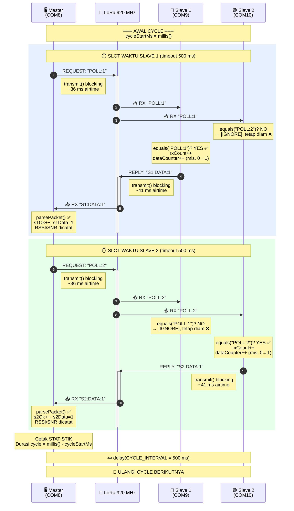
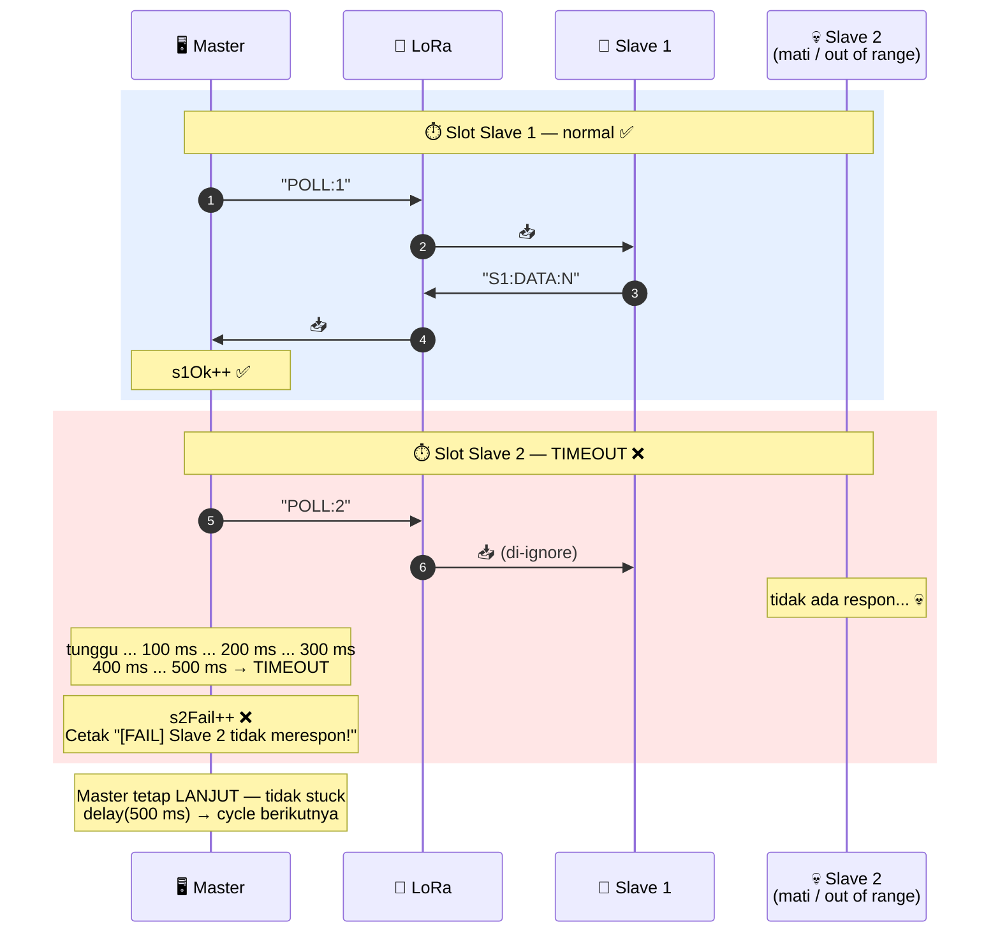
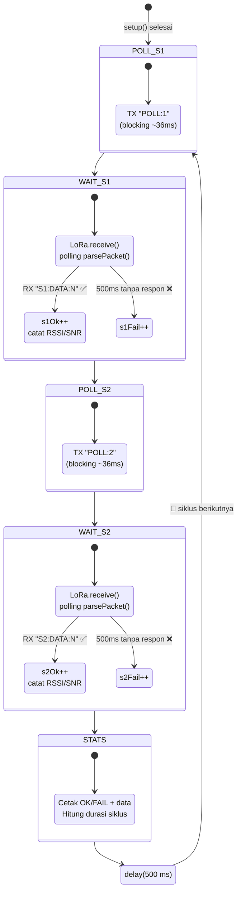

# 05 — LoRa Master-Slave 3 Node (Round-Robin Polling)

> **Target Hardware:** Dragino LoRa Shield v1.2 &nbsp;·&nbsp; MCU: Arduino Uno (ATmega328P) &nbsp;·&nbsp; LoRa: SX1276

[← Kembali ke README Utama](../../README.md)

---

## Daftar Isi

- [Pendahuluan](#pendahuluan)
- [Tujuan Program](#tujuan-program)
- [Hardware yang Digunakan](#hardware-yang-digunakan)
- [Pin Definition](#pin-definition)
- [Struktur File](#struktur-file)
- [Topologi Komunikasi](#topologi-komunikasi)
- [Alur Komunikasi (Communication Flow)](#alur-komunikasi-communication-flow)
- [Cara Kerja Detail](#cara-kerja-detail)
- [Format Payload](#format-payload)
- [Konfigurasi LoRa](#konfigurasi-lora)
- [Analisis Delay & Timing](#analisis-delay--timing)
- [Library yang Digunakan](#library-yang-digunakan)
- [Cara Penggunaan](#cara-penggunaan)
- [Monitor Dashboard untuk Evaluasi Praktikum](#monitor-dashboard-untuk-evaluasi-praktikum)
- [Contoh Output Serial Monitor](#contoh-output-serial-monitor)
- [Troubleshooting](#troubleshooting)

---

## Pendahuluan

Subproject `05-master-slave-3node` adalah implementasi komunikasi LoRa **Master-Slave** dengan **3 node** menggunakan metode **round-robin polling dengan time slicing**. Ini adalah topologi multi-node paling sederhana dan paling mudah dipelajari.

### 🧠 Konsep Inti — Wajib Paham Sebelum Baca Kode

Program ini menggunakan **dua konsep kunci** yang harus mahasiswa pahami terlebih dahulu:

#### 1. Polling (Master-Initiated Communication)

> **Master tidak mengirim data ke slave — Master justru meminta data dari slave.**

- **Master adalah pemegang kendali tunggal.** Slave **tidak pernah** bicara duluan, hanya menjawab.
- Master mengirim **permintaan** (`POLL:1`, `POLL:2`) → ini bukan data, ini "permintaan kirim data".
- Setiap Slave punya **ID unik**. Hanya slave yang ID-nya cocok yang akan menjawab; yang lain diam meskipun ikut mendengar paketnya.
- Slave menjawab dengan **data counter lokal** yang bertambah +1 **setiap kali berhasil menjawab Master**.

Analogi: bayangkan guru (Master) di kelas memanggil murid satu per satu, _"Nomor 1, laporkan nilaimu!"_ → hanya murid nomor 1 yang berdiri dan menjawab. Murid lainnya diam meskipun mendengar panggilan itu.

#### 2. Time Slicing (Penjadwalan Berdasarkan Waktu)

> **Setiap slave mendapat "jatah waktu" 500 ms untuk menjawab. Habis itu, giliran slave berikutnya — mau dia jawab atau tidak.**

- Master memberi waktu tunggu (**timeout = 500 ms**) per slave untuk merespon.
- Jika dalam 500 ms slave tidak menjawab → Master catat **FAIL** dan **langsung pindah** ke slave berikutnya. Master **tidak pernah stuck** menunggu slave yang mati.
- Setelah satu siklus penuh (poll S1 + poll S2) selesai, Master tidur 500 ms (`CYCLE_INTERVAL`) sebelum memulai siklus baru.

Analogi: setiap murid dipanggil dengan stopwatch 500 ms. Kalau dalam 500 ms tidak ada respon, guru lanjut ke murid berikutnya — tidak ada kelas yang terlambat karena satu murid bolos.

#### Gabungan: Round-Robin Polling

Setiap **cycle** Master melakukan urutan yang sama: `POLL:1` → tunggu jawaban (≤500 ms) → `POLL:2` → tunggu jawaban (≤500 ms) → `delay(500 ms)` → ulangi. Karena hanya satu node yang TX pada satu waktu (diatur oleh Master), **tidak ada tabrakan paket (collision)**.

---

### Tiga File Terpisah

Terdapat **tiga file terpisah** — satu per board, langsung upload tanpa konfigurasi manual:

| File | Board | Port | Peran |
|---|---|---|---|
| `master.ino` | Arduino Uno + Shield | COM3 | **MASTER** — meminta data dari Slave 1 & Slave 2 bergantian |
| `slave1.ino` | Arduino Uno + Shield | COM4 | **SLAVE 1** — menjawab `S1:DATA:N` hanya jika dipanggil `POLL:1` |
| `slave2.ino` | Arduino Uno + Shield | COM5 | **SLAVE 2** — menjawab `S2:DATA:N` hanya jika dipanggil `POLL:2` |

Fitur utama:
- **Round-robin polling dengan time slicing** — Master meminta data ke Slave satu per satu, masing-masing dengan slot 500 ms
- **TX blocking** (`endPacket()`) — andal di AVR, tidak bergantung ISR TX-done
- **RX polling** via `LoRa.parsePacket()` — tidak perlu ISR, bebas race condition, mudah dipahami
- **Timeout per slave** 500 ms — Master mencatat FAIL jika slave tidak merespon dalam slot waktunya
- **Statistik OK/FAIL** — Master melacak keberhasilan setiap slave per siklus
- **Counter data slave** — bertambah +1 setiap kali slave berhasil membalas Master

---

## Tujuan Program

- Memperagakan komunikasi LoRa multi-node (3 node) dengan topologi Master-Slave
- Mendemonstrasikan pola round-robin polling yang sederhana dan deterministik
- Menjadi fondasi untuk ekspansi ke lebih banyak node atau pola komunikasi yang lebih kompleks

---

## Hardware yang Digunakan

| Komponen | Detail |
|---|---|
| **Board utama** | Arduino Uno (ATmega328P) |
| **Shield LoRa** | Dragino LoRa Shield v1.2 |
| **Modul LoRa** | SX1276 (onboard shield) |
| **Frekuensi** | **920 MHz** |
| **LED** | LED built-in Arduino pada **D13** (shared dengan SPI SCK) |
| **Antena** | Antena LoRa eksternal via konektor SMA (wajib dipasang pada semua board) |
| **Jumlah board** | **3 set** — masing-masing upload file yang berbeda |

---

## Pin Definition

| Sinyal | Arduino Pin | Keterangan |
|---|---|---|
| NSS / CS | **D10** | SPI Chip Select (R9 = 0 ohm terpasang) |
| DIO0 | **D2** | Digunakan `parsePacket()` secara internal |
| RST | **D9** | Reset SX1276 |
| SCK | **D13** | SPI Clock (juga LED built-in) |
| MOSI | **D11** | SPI MOSI |
| MISO | **D12** | SPI MISO |

> D13 shared dengan SPI SCK — LED berkedip saat SPI aktif. Pasang LED eksternal di **D3** untuk notifikasi bersih.

---

## Struktur File

```
05-master-slave-3node/
├── README.md
├── lora_monitor.py         ← Monitor dashboard Python (evaluasi praktikum)
├── master/
│   └── master.ino          ← Upload ke COM3 (MASTER)
├── slave1/
│   └── slave1.ino          ← Upload ke COM4 (SLAVE 1)
└── slave2/
    └── slave2.ino          ← Upload ke COM5 (SLAVE 2)
```

---

## Topologi Komunikasi

```
┌──────────────────────────────────────────────────────────────────┐
│                         MASTER (COM3)                            │
│                       master.ino                                 │
│                                                                  │
│   loop() — setiap siklus:                                        │
│     1. POLL:1     ─── REQUEST ───►  SLAVE 1 (COM4)              │
│     2. S1:DATA:N  ◄── REPLY ─────   SLAVE 1                     │
│        (slot waktu 500 ms untuk Slave 1)                        │
│                                                                  │
│     3. POLL:2     ─── REQUEST ───►  SLAVE 2 (COM5)              │
│     4. S2:DATA:N  ◄── REPLY ─────   SLAVE 2                     │
│        (slot waktu 500 ms untuk Slave 2)                        │
│                                                                  │
│     5. delay(500 ms) → ulangi dari langkah 1                    │
└──────────────────────────────────────────────────────────────────┘

        LoRa 920 MHz                    LoRa 920 MHz
     ┌───────────────┐              ┌───────────────┐
     │   SLAVE 1     │              │   SLAVE 2     │
     │   COM4        │              │   COM5        │
     │   slave1.ino  │              │   slave2.ino  │
     │               │              │               │
     │ Tunggu POLL:1 │              │ Tunggu POLL:2 │
     │ counter++     │              │ counter++     │
     │ Balas S1:DATA │              │ Balas S2:DATA │
     └───────────────┘              └───────────────┘
```

### Sifat-sifat Komunikasi

| Aspek | Penjelasan |
|---|---|
| **Topologi** | Star (bintang) — Master di pusat, semua Slave hanya bicara ke Master |
| **Arah data** | Slave → Master (Master hanya **meminta**, tidak mengirim data) |
| **Mode** | Half-duplex, **Master-initiated** (Master selalu yang memulai) |
| **Penjadwalan** | Round-robin time slicing — 500 ms per slave |
| **Counter** | Setiap slave punya `dataCounter` lokal, naik +1 tiap kali berhasil balas |
| **Recovery** | Jika slave tidak merespon dalam 500 ms → Master catat FAIL & lanjut ke slave berikutnya |
| **Anti-collision** | Hanya satu node TX setiap saat karena Master mengatur giliran |

> **Catatan penting:** Master **tidak pernah mengirim data ke slave**. Yang dikirim Master hanyalah **permintaan** (`POLL:1` atau `POLL:2`). Data sesungguhnya (`S1:DATA:N`, `S2:DATA:N`) selalu mengalir dari Slave ke Master.

---

## Alur Komunikasi (Communication Flow)

### Diagram 1 — Sequence Diagram: Polling dengan Time Slicing

Diagram ini menunjukkan **satu cycle penuh** komunikasi: bagaimana Master meminta data, bagaimana setiap Slave merespon (atau mengabaikan), dan bagaimana **slot waktu 500 ms** dialokasikan untuk masing-masing Slave.



### Cara Membaca Diagram

1. **Panah ke `Air`** = node sedang mengirim paket ke "udara" LoRa (broadcast — semua node bisa dengar).
2. **Panah dari `Air` ke node** = paket sampai di node tersebut (semua slave selalu menerima paket, tapi hanya yang ID-nya cocok yang merespon).
3. **Kotak biru muda** = slot waktu **Slave 1**. Selama 500 ms ini, Master hanya peduli pada balasan dari Slave 1.
4. **Kotak hijau muda** = slot waktu **Slave 2**. Slave 1 sudah "selesai gilirannya" dan hanya jadi pendengar pasif.
5. **`[IGNORE]`** = slave menerima paket tapi ID tidak cocok → tidak balas, tidak counter naik, tidak apa-apa.
6. **`dataCounter++`** = counter di dalam slave hanya naik **saat slave benar-benar membalas**, bukan setiap kali menerima paket.

---

### Diagram 1B — Kasus Slave 2 Mati (Time Slicing Beraksi)

Diagram ini menunjukkan **kekuatan time slicing**: kalau Slave 2 mati, Master tidak ikut macet — dia tunggu 500 ms lalu lanjut.



Inilah inti **time slicing**: setiap slave punya jatah maksimum 500 ms. Habis itu, Master pindah. Sistem tetap berjalan walaupun satu (atau semua) slave mati.

---

### Diagram 2 — State Diagram: Mesin Status Master

Diagram ini menunjukkan **logika keputusan internal Master** — kapan Master mengirim, kapan menunggu, dan apa yang terjadi saat timeout.



> **Cara baca diagram:** Kotak bulet = state, panah = transisi. Path hijau (✅) = sukses, path merah (❌) = timeout. Jika Slave 1 timeout, Master tetap lanjut ke Slave 2 — tidak stuck.

---

### Ringkasan Per Siklus

| No | Aktor | Aksi | Air Time | Kondisi |
|----|-------|------|----------|---------|
| 1 | Master | TX `POLL:1` — **meminta** data ke Slave 1 | ~36 ms | Blocking |
| 2 | Slave 1 | RX → cocok ID → `counter++` → TX `S1:DATA:N` | ~41 ms | Balas |
| 3 | Slave 2 | RX → ID mismatch → abaikan | — | `[IGNORE]` |
| 4 | Master | RX `S1:DATA:N` → catat RSSI/SNR | — | `s1Ok++` |
| 5 | Master | TX `POLL:2` — **meminta** data ke Slave 2 | ~36 ms | Blocking |
| 6 | Slave 2 | RX → cocok ID → `counter++` → TX `S2:DATA:N` | ~41 ms | Balas |
| 7 | Slave 1 | RX → ID mismatch → abaikan | — | `[IGNORE]` |
| 8 | Master | RX `S2:DATA:N` → catat RSSI/SNR | — | `s2Ok++` |
| 9 | Master | Cetak statistik + `delay(500 ms)` | — | 🔁 Loop |

---

### Simulasi 3 Cycle Pertama (Semua Board Direset Bersamaan)

Bagian ini adalah **simulasi langkah demi langkah** dari saat Master & semua Slave baru di-reset. Tujuannya supaya mahasiswa bisa melihat **persis** apa yang terjadi di setiap node dan **kapan counter naik**.

**Asumsi awal:**
- Master, Slave 1, dan Slave 2 baru saja di-upload / di-reset bersamaan
- Semua counter di slave dimulai dari **0**: `Slave1.dataCounter = 0`, `Slave2.dataCounter = 0`
- Semua statistik di master juga **0**: `s1Ok = s2Ok = 0`, `s1Data = s2Data = 0`

#### Timeline Visual 3 Cycle Pertama

```
Waktu →   0ms                                    ~800ms                              ~1600ms                             ~2400ms
          │                                       │                                   │                                   │
CYCLE 1   ├─[POLL:1]─[S1:DATA:1]─[POLL:2]─[S2:DATA:1]──delay(500ms)──┤
          │                                                              │
CYCLE 2                                                                  ├─[POLL:1]─[S1:DATA:2]─[POLL:2]─[S2:DATA:2]──delay(500ms)──┤
          │                                                                                                                          │
CYCLE 3                                                                                                                              ├─[POLL:1]─[S1:DATA:3]─[POLL:2]─[S2:DATA:3]──...
          │
          └─ counter Slave 1: 0 → 1 → 2 → 3 → ...
              counter Slave 2: 0 → 1 → 2 → 3 → ...
```

Perhatikan: counter slave **selalu sama dengan nomor cycle** kalau tidak pernah ada FAIL. Inilah yang dimaksud "data counter naik tiap kali slave menjawab Master".

---

#### 🔁 CYCLE 1 — Counter slave mulai dari 0

| Langkah | Node | Apa yang terjadi | Frame di udara | State setelah langkah |
|---------|------|-----------------|----------------|----------------------|
| 1 | **Master** | Mulai cycle 1, `cycleStartMs = millis()` | — | — |
| 2 | **Master** | `transmit("POLL:1")` — Master MEMINTA data ke Slave 1 | **`POLL:1`** | — |
| 3 | **Slave 1** | `parsePacket()` → terima `POLL:1` → `equals("POLL:1")` = **YES ✅** | *(paket diterima)* | `rxCount=1` |
| 4 | **Slave 2** | `parsePacket()` → terima `POLL:1` → `equals("POLL:2")` = **NO** → cetak `[IGNORE]` | *(diam, tidak TX)* | `dataCounter=0` (tidak berubah) |
| 5 | **Slave 1** | `dataCounter++` (0 → **1**) → siapkan reply | — | `dataCounter=1` |
| 6 | **Slave 1** | `transmit("S1:DATA:1")` — Slave 1 KIRIM data ke Master | **`S1:DATA:1`** | — |
| 7 | **Master** | `parsePacket()` di dalam `pollSlave(1, ...)` → cocok prefix `S1:DATA:` → `dataOut=1`, `s1Ok++` | — | `s1Ok=1, s1Data=1` |
| 8 | **Master** | `transmit("POLL:2")` — Master MEMINTA data ke Slave 2 | **`POLL:2`** | — |
| 9 | **Slave 1** | `parsePacket()` → terima `POLL:2` → `equals("POLL:1")` = **NO** → cetak `[IGNORE]` | *(diam)* | `dataCounter=1` (tidak berubah) |
| 10 | **Slave 2** | `parsePacket()` → terima `POLL:2` → `equals("POLL:2")` = **YES ✅** | — | `rxCount=1` |
| 11 | **Slave 2** | `dataCounter++` (0 → **1**) | — | `dataCounter=1` |
| 12 | **Slave 2** | `transmit("S2:DATA:1")` — Slave 2 KIRIM data ke Master | **`S2:DATA:1`** | — |
| 13 | **Master** | `parsePacket()` di dalam `pollSlave(2, ...)` → cocok prefix `S2:DATA:` | — | `s2Ok=1, s2Data=1` |
| 14 | **Master** | Cetak STATISTIK + `delay(500 ms)` | — | siap cycle berikutnya |

**Hasil Cycle 1:** `S1: OK=1, Data=1` &nbsp;|&nbsp; `S2: OK=1, Data=1`

---

#### 🔁 CYCLE 2 — Counter slave naik ke 2

| Langkah | Node | Apa yang terjadi | Frame di udara | State setelah langkah |
|---------|------|-----------------|----------------|----------------------|
| 1 | **Master** | `transmit("POLL:1")` | **`POLL:1`** | — |
| 2 | **Slave 1** | RX `POLL:1` → cocok → `dataCounter++` (1 → **2**) → TX | **`S1:DATA:2`** | `rxCount=2, dataCounter=2` |
| 3 | **Slave 2** | RX `POLL:1` → tidak cocok → `[IGNORE]` | *(diam)* | tetap |
| 4 | **Master** | RX `S1:DATA:2` → parsing → `s1Ok++` | — | `s1Ok=2, s1Data=2` |
| 5 | **Master** | `transmit("POLL:2")` | **`POLL:2`** | — |
| 6 | **Slave 1** | RX `POLL:2` → tidak cocok → `[IGNORE]` | *(diam)* | tetap |
| 7 | **Slave 2** | RX `POLL:2` → cocok → `dataCounter++` (1 → **2**) → TX | **`S2:DATA:2`** | `rxCount=2, dataCounter=2` |
| 8 | **Master** | RX `S2:DATA:2` → parsing → `s2Ok++` | — | `s2Ok=2, s2Data=2` |

**Hasil Cycle 2:** `S1: OK=2, Data=2` &nbsp;|&nbsp; `S2: OK=2, Data=2`

---

#### 🔁 CYCLE 3 — Counter slave naik ke 3

| Langkah | Node | Apa yang terjadi | Frame di udara | State setelah langkah |
|---------|------|-----------------|----------------|----------------------|
| 1 | **Master** | `transmit("POLL:1")` | **`POLL:1`** | — |
| 2 | **Slave 1** | RX → cocok → `dataCounter++` (2 → **3**) → TX | **`S1:DATA:3`** | `rxCount=3, dataCounter=3` |
| 3 | **Slave 2** | RX → `[IGNORE]` | *(diam)* | tetap |
| 4 | **Master** | RX `S1:DATA:3` → parsing | — | `s1Ok=3, s1Data=3` |
| 5 | **Master** | `transmit("POLL:2")` | **`POLL:2`** | — |
| 6 | **Slave 1** | RX → `[IGNORE]` | *(diam)* | tetap |
| 7 | **Slave 2** | RX → cocok → `dataCounter++` (2 → **3**) → TX | **`S2:DATA:3`** | `rxCount=3, dataCounter=3` |
| 8 | **Master** | RX `S2:DATA:3` → parsing | — | `s2Ok=3, s2Data=3` |

**Hasil Cycle 3:** `S1: OK=3, Data=3` &nbsp;|&nbsp; `S2: OK=3, Data=3`

---

#### 📊 Ringkasan Setelah 3 Cycle

| Cycle | POLL → Slave 1 | Balasan Slave 1 | POLL → Slave 2 | Balasan Slave 2 | Slave1.dataCounter | Slave2.dataCounter |
|:-----:|:--------------:|:---------------:|:--------------:|:---------------:|:------------------:|:------------------:|
| 1 | `POLL:1` | `S1:DATA:1` | `POLL:2` | `S2:DATA:1` | **1** | **1** |
| 2 | `POLL:1` | `S1:DATA:2` | `POLL:2` | `S2:DATA:2` | **2** | **2** |
| 3 | `POLL:1` | `S1:DATA:3` | `POLL:2` | `S2:DATA:3` | **3** | **3** |

**Pola yang harus dipahami:**
1. Master selalu mengirim pesan yang **sama persis** setiap cycle: `POLL:1` lalu `POLL:2`. Master tidak pernah mengirim data — hanya permintaan.
2. Counter slave naik **+1 per cycle** (selama tidak ada FAIL), karena slave hanya menambah counter saat dia berhasil membalas.
3. Setiap slave **mendengar semua paket** di udara, tapi hanya bereaksi pada paket yang ID-nya cocok.

> **Kunci diagnosis:** Kalau semua board direset bersamaan, `OK` di Master selalu ≈ `Data` di Slave. Kalau `Data` jauh lebih besar dari `OK` (misal `OK=4993, Data=5979`), artinya **Master pernah di-restart sendiri** sedangkan Slave tetap nyala — sehingga `dataCounter` Slave lanjut dari nilai sebelumnya tanpa reset, sementara `s1Ok / s2Ok` di Master mulai dari 0 lagi.

---

## Cara Kerja Detail

### TX — Blocking

```cpp
void transmit(const String& msg) {
  LoRa.beginPacket();
  LoRa.print(msg);
  LoRa.endPacket();  // tunggu sampai TX selesai, baru return
}
```

- Setelah `endPacket()` return, SX1276 otomatis kembali ke STANDBY
- Tidak perlu ISR TX-done — lebih sederhana dan andal di AVR

### RX — Polling `parsePacket()`

```cpp
int ps = LoRa.parsePacket();
if (ps > 0) { /* ada paket */ }
```

- Setiap panggilan: cek IRQ register, jika ada paket kembalikan ukurannya
- Tidak perlu interrupt, tidak ada race condition, tidak perlu `volatile` flag

### Addressing

Setiap slave memiliki ID unik. Slave hanya merespon jika pesan persis cocok dengan ID-nya:

```cpp
// slave1.ino
if (!received.equals("POLL:1")) {
  Serial.print("[IGNORE] "); Serial.println(received);
  return;  // abaikan, bukan panggilan untuk saya
}
```

Ini mencegah semua slave merespon secara bersamaan (collision avoidance).

### Timeout Handling (Master)

```cpp
if (!pollSlave(1, ...)) {  // timeout 500 ms
  failCount++;             // slave tidak merespon
}
// tetap lanjut ke slave berikutnya
```

Master tidak stuck jika satu slave mati — langsung lanjut ke slave berikutnya.

---

## Format Payload

| Arah | Format | Contoh | Makna |
|---|---|---|---|
| **Master → Slave N** | `POLL:N` | `POLL:1` | **Request** dari Master: "Slave N, kirim data-mu!" |
| **Slave N → Master** | `SN:DATA:N` | `S1:DATA:42` | **Reply** dari Slave N: "Ini data counterku, nilainya 42" |

Anatomi pesan:
- `POLL:` — prefix tetap, menandakan ini adalah permintaan dari Master
- `N` (setelah `POLL:`) — **ID slave yang dituju** (1 atau 2)
- `S1:` / `S2:` — prefix identitas slave (siapa yang mengirim)
- `DATA:` — penanda data berikutnya
- `N` (setelah `DATA:`) — **nilai counter slave**, naik +1 setiap slave berhasil membalas Master

> **Master tidak pernah mengirim data ke slave** — yang dikirim Master hanya permintaan (`POLL:1` / `POLL:2`). Data sesungguhnya selalu mengalir dari Slave ke Master.

---

## Konfigurasi LoRa

| Parameter | Nilai | Keterangan |
|---|---|---|
| **Frekuensi** | **920 MHz** | Harus sama di semua node |
| **Bandwidth** | **125 kHz** | Harus sama di semua node |
| **Spreading Factor** | **SF7** | Harus sama di semua node |
| **Coding Rate** | **4/5** | Harus sama di semua node |
| **TX Power** | **17 dBm** | Boleh berbeda (tapi disamakan) |

> **PENTING:** Parameter Bandwidth, Spreading Factor, Coding Rate, dan Frekuensi **harus identik** pada semua node (Master dan kedua Slave). Jika tidak, paket tidak akan bisa diterima.

---

## Analisis Delay & Timing

### Perhitungan Air Time (Waktu Udara) Teoretis

Menggunakan rumus standar Semtech SX1276 untuk **SF7, BW 125 kHz, CR 4/5, explicit header, CRC enabled**.

| Parameter | Rumus | Nilai |
|---|---|---|
| Symbol time (T_sym) | 2^SF / BW | 128 / 125000 = **1.024 ms** |
| Preamble (n_preamble=8) | (8 + 4.25) × T_sym | **12.544 ms** |

**Payload "POLL:1" (~8 byte):**
| Komponen | Perhitungan | Hasil |
|---|---|---|
| Payload symbols | 8 + max(ceil((8×8 - 28 + 44) / 28) × 5, 0) | **23 symbols** |
| Payload time | 23 × 1.024 | **23.55 ms** |
| **Total TX airtime** | 12.544 + 23.55 | **≈ 36 ms** |

**Payload "S1:DATA:99" (~12 byte):**
| Komponen | Perhitungan | Hasil |
|---|---|---|
| Payload symbols | 8 + max(ceil((8×12 - 28 + 44) / 28) × 5, 0) | **28 symbols** |
| Payload time | 28 × 1.024 | **28.67 ms** |
| **Total TX airtime** | 12.544 + 28.67 | **≈ 41 ms** |

### Total Delay Per Siklus (Estimasi & Terukur)

| Tahap | Air Time | SW Overhead | Total |
|---|---|---|---|
| Master TX `POLL:1` | ~36 ms | ~10 ms | ~46 ms |
| Slave 1 RX + proses | — | ~5 ms | ~5 ms |
| Slave 1 TX `S1:DATA:N` | ~41 ms | ~10 ms | ~51 ms |
| Master RX + proses | — | ~5 ms | ~5 ms |
| Master TX `POLL:2` | ~36 ms | ~10 ms | ~46 ms |
| Slave 2 RX + proses | — | ~5 ms | ~5 ms |
| Slave 2 TX `S2:DATA:N` | ~41 ms | ~10 ms | ~51 ms |
| Master RX + proses | — | ~15 ms | ~15 ms |
| **Subtotal exchange** | | | **~224 ms** |
| `delay(CYCLE_INTERVAL)` | | | **500 ms** |
| **Total per siklus** | | | **~700–800 ms** |

> **Catatan:** Durasi aktual akan terukur dan ditampilkan oleh Master setiap siklus (`Durasi siklus: XXX ms`). Nilai di atas adalah estimasi; hasil nyata dapat bervariasi ±20% tergantung interferensi RF, suhu, dan toleransi osilator.

### Mengapa Parameter Harus Sama?

Spreading Factor dan Bandwidth menentukan **chip rate** dan **symbol rate**:

```
Chip rate = BW (chip/s)
Symbol rate = BW / 2^SF (symbol/s)
```

Jika Master memakai SF7 (128 chips/symbol) tapi Slave memakai SF8 (256 chips/symbol), symbol rate berbeda dan chip timing tidak sinkron → paket tidak ter-decode. **Semua node harus dikonfigurasi identik.**

---

## Library yang Digunakan

| Library | Versi | Fungsi | Install |
|---|---|---|---|
| `LoRa` (sandeepmistry) | 0.8.x | Driver SX1276: TX, RX polling, RSSI, SNR | `arduino-cli lib install "LoRa"` |
| `SPI.h` | bawaan Arduino | Komunikasi SPI hardware ke SX1276 | Sudah tersedia |

---

## Cara Penggunaan

> **Upload Slave dulu**, baru Master — agar semua Slave sudah siap menerima saat Master mulai polling.

### 1. Upload Slave 2 → COM5

```bash
arduino-cli compile --fqbn arduino:avr:uno slave2
arduino-cli upload -p COM5 --fqbn arduino:avr:uno slave2
```

### 2. Upload Slave 1 → COM4

```bash
arduino-cli compile --fqbn arduino:avr:uno slave1
arduino-cli upload -p COM4 --fqbn arduino:avr:uno slave1
```

### 3. Upload Master → COM3

```bash
arduino-cli compile --fqbn arduino:avr:uno master
arduino-cli upload -p COM3 --fqbn arduino:avr:uno master
```

Buka Serial Monitor ketiga port (baud **115200**). Master-Slave polling akan berjalan otomatis.

> Tutup Serial Monitor sebelum upload — port COM tidak bisa digunakan bersamaan.

---

## Monitor Dashboard untuk Evaluasi Praktikum

`lora_monitor.py` adalah tool Python yang dirancang khusus untuk **observasi dan evaluasi penelitian** pada sesi praktikum LoRa. Tool ini membaca data dari ketiga port COM secara bersamaan dan menampilkan dashboard real-time di terminal.

### Mengapa Baud Rate 115200?

Dengan baud rate **115200** (vs 9600 sebelumnya), latensi serial turun drastis:

| Baud Rate | Waktu kirim 1 byte | Pengaruh ke timestamp CSV |
|---|---|---|
| 9600 | ~1.04 ms | Delay > 10 ms per baris log |
| **115200** | **~0.087 ms** | Delay < 1 ms per baris log — akurat untuk analisis timing |

Untuk eksperimen yang mengukur **delay cycle, RSSI, dan packet loss**, akurasi timestamp CSV sangat penting agar data bisa dipercaya.

---

### Instalasi Dependensi

```bash
pip install pyserial rich
```

---

### Contoh Output: Tanpa Argumen (`python lora_monitor.py`)

Saat dijalankan tanpa argumen apapun, tool menampilkan banner keterangan lengkap sebelum mulai:

```
╔══════════════════════════════════════════════════════════════════════╗
║           LoRa Master-Slave Monitor — Evaluasi Praktikum            ║
║      Dragino LoRa Shield v1.2 · SX1276 · Arduino Uno · 920 MHz     ║
╚══════════════════════════════════════════════════════════════════════╝

  Tool ini membaca data serial dari 3 node LoRa secara bersamaan dan
  menampilkan dashboard real-time: statistik OK/FAIL per slave, durasi
  cycle, RSSI/SNR, deteksi anomali, serta logging CSV otomatis untuk
  analisis data penelitian.

  PENGGUNAAN:
    python lora_monitor.py [opsi...]

  OPSI:
    --master PORT   Port COM untuk node Master      (default: COM3)
    --s1     PORT   Port COM untuk Slave 1          (default: COM4)
    --s2     PORT   Port COM untuk Slave 2          (default: COM5)
    --baud   N      Baud rate serial semua port     (default: 115200)
    --out    FILE   Nama file CSV output            (default: lora_session_YYYYMMDD_HHMMSS.csv)
    -h / --help     Tampilkan pesan bantuan ini

  CONTOH:
    python lora_monitor.py
        → Jalankan dengan port & baud rate default

    python lora_monitor.py --master COM3 --s1 COM4 --s2 COM5
        → Tentukan port secara eksplisit

    python lora_monitor.py --out data_jarak_10m.csv
        → Simpan log ke nama file tertentu

    python lora_monitor.py --master COM3 --s1 COM4 --s2 COM5 --baud 115200 --out hasil_uji.csv
        → Konfigurasi penuh untuk satu sesi eksperimen

  KONTROL DASHBOARD:
    Ctrl+C          Hentikan monitoring & simpan CSV

  CATATAN:
    • Pastikan semua board sudah di-upload firmware dengan baud 115200
    • Upload Slave dulu, baru Master, sebelum menjalankan tool ini
    • File CSV tersimpan otomatis saat Ctrl+C ditekan

Tidak ada argumen → menggunakan default: Master=COM3 S1=COM4 S2=COM5 Baud=115200

  CSV    : lora_session_20260516_064207.csv

Tekan Enter untuk mulai dashboard, Ctrl+C untuk batal...
```

---

### Contoh Output: `python lora_monitor.py --help`

```
usage: lora_monitor.py [-h] [--master PORT] [--s1 PORT] [--s2 PORT] [--baud N] [--out FILE]

LoRa Master-Slave Monitor Dashboard — tool evaluasi praktikum LoRa.

options:
  -h, --help     show this help message and exit
  --master PORT  Port COM node Master (default: COM3)
  --s1 PORT      Port COM Slave 1 (default: COM4)
  --s2 PORT      Port COM Slave 2 (default: COM5)
  --baud N       Baud rate serial (default: 115200)
  --out FILE     Nama file CSV output (default: auto timestamp)

Contoh penggunaan:
  python lora_monitor.py
  python lora_monitor.py --master COM3 --s1 COM4 --s2 COM5
  python lora_monitor.py --out data_eksperimen.csv
  python lora_monitor.py --master COM3 --s1 COM4 --s2 COM5 --baud 115200 --out hasil.csv
```

---

### Cara Menjalankan

```bash
# Default: COM8 (Master), COM9 (Slave 1), COM10 (Slave 2) @ 115200 baud
python lora_monitor.py

# Port custom
python lora_monitor.py --master COM3 --s1 COM4 --s2 COM5

# Simpan CSV dengan nama eksplisit
python lora_monitor.py --out data_eksperimen_jarak10m.csv

# Kombinasi semuanya
python lora_monitor.py --master COM3 --s1 COM4 --s2 COM5 --baud 115200 --out hasil_uji.csv
```

---

### Tampilan Dashboard

```
┌─── MASTER ─────────────────┐ ┌─── SLAVE 1 ────────────────┐ ┌─── SLAVE 2 ────────────────┐
│ ● CONNECTED: COM8          │ │ ● CONNECTED: COM9          │ │ ● CONNECTED: COM10         │
│                            │ │                            │ │                            │
│ Cycle       :   127        │ │ RX Count   :   127         │ │ RX Count   :   126         │
│ Dur. Cycle  :   231 ms     │ │ TX Counter :   127         │ │ TX Counter :   126         │
│                            │ │                            │ │                            │
│ Slave 1                    │ │ Raw Log                    │ │ Raw Log                    │
│ OK    :    127             │ │ ────────────────────────   │ │ ────────────────────────   │
│ FAIL  :      0             │ │ 06:42:11  [RX] POLL:1 ... │ │ 06:42:11  [RX] POLL:2 ... │
│ Rate  : 100.00%            │ │ 06:42:11  [TX] S1:DATA:.. │ │ 06:42:11  [TX] S2:DATA:.. │
│ Data  :    127             │ │ ...                        │ │ ...                        │
│                            │ └────────────────────────────┘ └────────────────────────────┘
│ Slave 2                    │
│ OK    :    126             │ ┌─── ANOMALI DETECTOR ───────────────────────────────────────┐
│ FAIL  :      1             │ │ Session: 00:21:07   CSV: lora_session_20260516.csv         │
│ Rate  :  99.21%            │ │                                                            │
│ Data  :    126             │ │ [06:21:43] [S2] FAIL_STREAK: S2 FAIL beruntun 3x          │
└────────────────────────────┘ └────────────────────────────────────────────────────────────┘
```

---

### Fitur untuk Evaluasi Penelitian

| Fitur | Deskripsi | Metrik yang diukur |
|---|---|---|
| **Live Stats per Node** | OK count, FAIL count, success rate, data counter | Packet Delivery Ratio (PDR) |
| **Cycle Duration** | Durasi aktual tiap siklus polling | Latency & throughput |
| **RSSI / SNR** | Terlihat di raw log (dari Serial Master/Slave) | Link quality vs jarak/hambatan |
| **Anomaly Detector** | Otomatis tandai FAIL beruntun, lompatan counter, cycle lambat | Deteksi degradasi link |
| **CSV Logger** | Setiap baris serial dari semua node dicatat dengan timestamp | Dataset untuk analisis offline |

#### Threshold Anomali (dapat diubah di kode)

```python
FAIL_STREAK_WARN = 3     # warning jika slave FAIL >= 3x berturut-turut
CYCLE_SLOW_MS   = 900    # warning jika satu cycle > 900 ms (indikasi timeout)
```

---

### Alur Evaluasi Praktikum — Step by Step

```
1. Upload firmware ke semua board (Slave dulu, baru Master)
2. Jalankan: python lora_monitor.py --out data_[nama_eksperimen].csv
3. Tekan Enter → dashboard muncul, logging dimulai
4. Lakukan variasi eksperimen (ubah jarak, orientasi antena, tambahkan penghalang)
5. Amati perubahan RSSI, SNR, FAIL rate, dan Durasi Cycle di dashboard
6. Tekan Ctrl+C untuk selesai → file CSV tersimpan otomatis
7. Buka CSV di Excel / Python (pandas) untuk analisis dan grafik
```

---

### Analisis CSV dengan Python (pandas)

```python
import pandas as pd
import matplotlib.pyplot as plt

df = pd.read_csv("lora_session_20260516_064207.csv")

# Filter baris yang mengandung data RSSI dari Master
rssi_lines = df[df['raw_line'].str.contains(r'\[RX\].*RSSI', na=False)]
rssi_values = rssi_lines['raw_line'].str.extract(r'RSSI:\s*(-?\d+)')
rssi_values.columns = ['rssi']
rssi_values['rssi'] = rssi_values['rssi'].astype(int)

rssi_values['rssi'].plot(title='RSSI over time', ylabel='dBm')
plt.tight_layout()
plt.savefig('rssi_plot.png')
print(f"Total sampel RSSI: {len(rssi_values)}")
print(rssi_values.describe())
```

---

### Format CSV Output

```
timestamp,node,raw_line
06:42:07.841,MASTER,=== CYCLE 127 ===
06:42:07.843,MASTER,[TX] POLL:1
06:42:07.921,S1,[RX] POLL:1 | RSSI: -48 dBm | SNR: 9.50 dB | RX#: 127
06:42:07.923,S1,[TX] S1:DATA:127
06:42:07.964,MASTER,[RX] S1:DATA:127 | RSSI: -48 dBm | SNR: 9.50 dB
...
```

Setiap baris memiliki:
- `timestamp` — waktu penerimaan data di PC (resolusi milidetik)
- `node` — sumber data: `MASTER`, `S1`, atau `S2`
- `raw_line` — teks persis yang dikirim board melalui Serial

---

## Contoh Output Serial Monitor

### Master — COM8

```
=== LoRa MASTER-SLAVE 3 NODE ===
Init LoRa ... OK
Freq: 920.00 MHz
SF7 | BW: 125 kHz
Peran: MASTER (COM8)
Slave: COM9 (S1) & COM10 (S2)

========================================
=== CYCLE 1 ===
[TX] POLL:1
[RX] S1:DATA:1 | RSSI: -48 dBm | SNR: 9.50 dB
[TX] POLL:2
[RX] S2:DATA:1 | RSSI: -52 dBm | SNR: 8.25 dB
--- STATISTIK ---
S1: OK=1 | FAIL=0 | Data: 1
S2: OK=1 | FAIL=0 | Data: 1
Durasi siklus: 234 ms
========================================

========================================
=== CYCLE 2 ===
[TX] POLL:1
[RX] S1:DATA:2 | RSSI: -47 dBm | SNR: 9.75 dB
[TX] POLL:2
[RX] S2:DATA:2 | RSSI: -50 dBm | SNR: 9.00 dB
--- STATISTIK ---
S1: OK=2 | FAIL=0 | Data: 2
S2: OK=2 | FAIL=0 | Data: 2
Durasi siklus: 218 ms
========================================
```

### Slave 1 — COM9

```
=== LoRa SLAVE 1 ===
Init LoRa ... OK
Freq: 920.00 MHz
Menunggu POLL:1 dari Master...

[RX] POLL:1 | RSSI: -48 dBm | SNR: 9.50 dB | RX#: 1
[TX] S1:DATA:1

[RX] POLL:1 | RSSI: -47 dBm | SNR: 9.75 dB | RX#: 2
[TX] S1:DATA:2
```

### Slave 2 — COM10

```
=== LoRa SLAVE 2 ===
Init LoRa ... OK
Freq: 920.00 MHz
Menunggu POLL:2 dari Master...

[RX] POLL:2 | RSSI: -52 dBm | SNR: 8.25 dB | RX#: 1
[TX] S2:DATA:1

[RX] POLL:2 | RSSI: -50 dBm | SNR: 9.00 dB | RX#: 2
[TX] S2:DATA:2
```

### Jika Slave 2 mati — Master tetap jalan

```
=== CYCLE 5 ===
[TX] POLL:1
[RX] S1:DATA:5 | RSSI: -46 dBm | SNR: 10.00 dB
[TX] POLL:2
[FAIL] Slave 2 tidak merespon!
--- STATISTIK ---
S1: OK=5 | FAIL=0 | Data: 5
S2: OK=4 | FAIL=1 | Data: 4
Durasi siklus: 712 ms   ← lebih lama karena timeout 500 ms untuk S2
========================================
```

---

## Keterbatasan & Analisis Masalah (Known Issues)

> Bagian ini menjelaskan **mengapa data bisa inkonsisten** setelah ratusan atau ribuan cycle — bukan karena kode salah, tapi karena sifat dasar sistem polling LoRa tanpa mekanisme ACK. Wajib dipahami mahasiswa sebelum menarik kesimpulan dari data eksperimen.

---

### Gambaran Besar: Mengapa Inkonsistensi Terjadi?

Sistem ini menggunakan **polling sederhana tanpa acknowledgement (ACK)**. Artinya:
- Master tidak tahu apakah paket `POLL:N` benar-benar sampai ke slave
- Slave tidak tahu apakah balasannya `SN:DATA:N` benar-benar diterima Master
- Tidak ada retransmit — kalau paket hilang, hilang begitu saja

Ini bukan bug — ini **desain yang disengaja** untuk kesederhanaan dan keterbacaan kode. Tapi konsekuensinya harus dipahami.

---

### Masalah 1 — Inkonsistensi Counter: `dataCounter` Naik Sebelum TX (Sudah Diperbaiki ✅)

**Versi lama (bermasalah):**
```cpp
rxCount++;
dataCounter++;      // ← naik DULU
// ... Serial.print ...
transmit(reply);    // ← baru TX — tapi kalau ini gagal, counter sudah terlanjur naik
```

**Versi baru (diperbaiki):**
```cpp
rxCount++;
// ... Serial.print ...
dataCounter++;      // ← naik SETELAH Serial.print selesai
transmit(reply);    // ← TX dengan nilai counter yang sudah final
```

**Mengapa urutan ini penting?**

`dataCounter` seharusnya merepresentasikan *"berapa kali slave BERHASIL mengirim data ke Master"*. Kalau counter naik sebelum TX, dan ternyata TX gagal (SX1276 hang sebentar, buffer penuh, dsb), Master tidak pernah menerima data itu — tapi di sisi slave counter sudah naik. Cycle berikutnya Master menerima `S1:DATA:N+1` padahal `S1:DATA:N` tidak pernah ada. Di log Master akan terlihat **lompatan angka** yang membingungkan.

**Dampak nyata di 3000 cycle:** Setiap kali ada TX failure (walaupun jarang), terjadi satu lompatan. Kalau ada 10 lompatan dari 3000 cycle, data terlihat tidak konsisten padahal sistem "berjalan normal".

---

### Masalah 2 — Overflow `int` di Cycle ke-32.768 (Sudah Diperbaiki ✅)

**Versi lama:**
```cpp
int dataCounter = 0;   // AVR: 16-bit signed, max = 32.767
```

**Versi baru:**
```cpp
unsigned long dataCounter = 0;  // AVR: 32-bit unsigned, max = 4.294.967.295
```

**Ilustrasi overflow:**

```
Cycle 32.767  → slave kirim  S1:DATA:32767   ← terakhir normal
Cycle 32.768  → slave kirim  S1:DATA:-32768  ← overflow! tiba-tiba jadi negatif
Cycle 32.769  → slave kirim  S1:DATA:-32767  ← terus naik dari nilai negatif
```

Di 3000 cycle ini belum terjadi, tapi kalau eksperimen dijalankan ~9 jam non-stop (3000 cycle × ~10 detik/cycle ≈ 8.3 jam), system akan mulai menunjukkan data aneh. Dengan `unsigned long`, sistem aman selama **lebih dari 136 tahun** operasi non-stop.

---

### Masalah 3 — Race Condition: Slave Belum Kembali ke Mode RX

**Sifatnya:** Sporadis, tidak deterministik, lebih sering terjadi saat interferensi RF tinggi.

**Mekanisme terjadinya:**

```
Timeline (tanpa jeda setelah TX di slave):

t=0ms    Master TX "POLL:1"            → sinyal di udara
t=36ms   Slave 1 RX selesai            → SX1276 slave 1 masih sibuk baca paket
t=37ms   Slave 1 dataCounter++
t=38ms   Slave 1 TX "S1:DATA:N"        → ~41ms di udara
t=79ms   Slave 1 TX selesai            → SX1276 auto masuk STANDBY
t=80ms   Slave 1 balik ke loop()
t=80ms   Master RX "S1:DATA:N" ✅
t=81ms   Master TX "POLL:2"            → sinyal di udara
         Slave 1 parsePacket()         → (ini POLL:2, akan di-ignore — tidak masalah)

... cycle berikutnya ...

t=1300ms Master TX "POLL:1" lagi
t=1301ms Slave 1 SX1276: apakah sudah di RX mode?
         → Kalau ada delay di Serial.print() atau SPI overhead,
           bisa saja Slave 1 MISS paket POLL:1 ini
```

**Kenapa tidak diperbaiki di kode?** Solusi yang bersih (`delay(10)` setelah `transmit()`) menambah "magic number" tanpa penjelasan jelas ke mahasiswa. Untuk konteks edukasi polling dasar, ini trade-off yang diterima. Solusi proper-nya adalah mekanisme ACK + retransmit — itu topik tersendiri.

**Cara mengenali masalah ini di log:** Master mencetak `[FAIL]` untuk slave yang sebenarnya hidup, tapi cycle berikutnya slave tersebut normal kembali. Pola FAIL yang **sporadis dan tidak berulang** = race condition. FAIL yang **konsisten dan terus-menerus** = masalah fisik (jarak, antena, interferensi).

---

### Masalah 4 — Paket Stale (Balasan Cycle Lama Terbaca di Cycle Baru)

**Mekanisme:**

```
Cycle N:
  Master TX "POLL:1"
  Slave 1 terlambat balas (misal karena Serial.print panjang)
  Master timeout 500ms → catat FAIL
  
  Tapi Slave 1 tetap TX "S1:DATA:N" — 10ms setelah timeout Master

Cycle N+1:
  Master TX "POLL:1"
  Master.receive() → parsePacket() → dapat paket!
  Baca isinya: "S1:DATA:N" ← ini paket dari cycle LAMA
  Master kira ini balasan cycle N+1 → catat OK, data = N
  
  Tapi Slave 1 juga balas cycle N+1 → "S1:DATA:N+1"
  Master sudah puas dapat satu balasan → tidak baca yang ini
```

**Efek di log Master:** `s1Ok` naik tapi nilai `s1Data` terlihat "ketinggalan satu cycle" — nilainya selalu satu lebih kecil dari yang diharapkan.

**Cara mengenali:** Durasi siklus di cycle N sangat panjang (mendekati 500ms timeout) diikuti cycle N+1 yang sangat singkat (< 50ms karena langsung dapat paket stale).

---

### Masalah 5 — Serial.print Blocking Menambah Latency

Baud rate **9600** = ~960 karakter/detik = ~1.04ms per karakter.

```
String "[RX] POLL:1 | RSSI: -48 dBm | SNR: 9.50 dB | RX#: 2999"
→ ~57 karakter → ~59ms hanya untuk Serial.print ini saja
```

Makin besar nomor cycle (RX# makin banyak digit), makin lama. Di cycle ke-3000, string Serial lebih panjang dari cycle ke-1. Ini memperlebar jendela waktu di mana slave belum siap RX.

**Solusi jika perlu diobservasi live:** Naikkan baud rate ke **115200** di semua tiga file (master + slave1 + slave2):
```cpp
Serial.begin(115200);  // ganti dari 9600
// string yang sama sekarang selesai dalam ~0.5ms, bukan ~59ms
```
Pastikan Serial Monitor di-set ke baud yang sama.

---

### Ringkasan: Apa yang Normal vs Apa yang Perlu Diperiksa

| Yang terlihat di log | Interpretasi | Perlu tindakan? |
|---|---|---|
| `[FAIL]` sporadis, langsung OK di cycle berikutnya | Race condition / interferensi sesaat | Tidak — ini normal di polling tanpa ACK |
| `[FAIL]` terus-menerus pada satu slave | Slave mati, antena lepas, jarak terlalu jauh | Ya — cek fisik slave tersebut |
| `s1Data` loncat dari N ke N+2 (ada yang skip) | TX failure di slave saat counter sudah naik (versi lama) | Sudah diperbaiki di versi ini ✅ |
| `s1Data` jauh lebih besar dari `s1Ok` | Master di-restart, slave tidak di-restart | Normal — reset semua board bersamaan |
| Data tiba-tiba jadi negatif di cycle ke-32.768 | `int` overflow (versi lama) | Sudah diperbaiki ke `unsigned long` ✅ |
| Durasi siklus cycle N panjang, cycle N+1 sangat singkat | Paket stale dari cycle sebelumnya | Observasional — tidak kritis untuk edukasi dasar |

---

### Catatan untuk Laporan / Analisis Data

Kalau mahasiswa menganalisis data dari 3000+ cycle:

1. **Hitung packet loss rate:** `FAIL / (OK + FAIL) × 100%`. Nilai < 5% di dalam ruangan dengan jarak < 5m adalah normal untuk setup ini.
2. **Cek distribusi FAIL:** Kalau FAIL tersebar acak → interferensi/race condition. Kalau FAIL mengelompok (banyak di waktu tertentu) → ada sumber interferensi periodik (microwave, WiFi burst, dsb).
3. **Jangan bandingkan `s1Data` dari Master dengan `rxCount` dari Slave** sebagai ukuran keberhasilan — keduanya dihitung di sisi berbeda dan bisa berbeda karena restart. Gunakan `s1Ok` vs `s1Fail` di Master sebagai metrik utama.

---

## Troubleshooting

| Masalah | Kemungkinan Penyebab | Solusi |
|---|---|---|
| `Init LoRa ... GAGAL!` | R9 tidak terpasang / shield tidak terpasang sempurna | Cek R9 (0 ohm), lepas-pasang shield |
| Master terus `[FAIL]` untuk kedua slave | Antena tidak terpasang / jarak terlalu jauh / parameter tidak identik | Pasang antena, perkecil jarak, pastikan semua pakai 920E6 / SF7 / 125kHz / CR 4/5 |
| Slave menerima `POLL:1` tapi tidak balas | `SLAVE_ID` tidak cocok / kode salah upload | Pastikan `slave1.ino` di-upload ke COM9, `slave2.ino` ke COM10 |
| Slave mencetak `[IGNORE]` terus-menerus | Slave menangkap paket yang bukan untuknya (dari slave lain) | Normal — slave hanya merespon ID-nya sendiri |
| Durasi siklus jauh lebih besar dari 800 ms | Satu slave timeout 500 ms (mati / di luar jangkauan) | Cek slave yang FAIL, nyalakan ulang |
| LED built-in D13 berkedip tidak jelas | D13 shared dengan SPI SCK — LED ikut aktivitas SPI | Normal; pasang LED eksternal di D3 |
| Upload error: `Access is denied` | Serial Monitor masih terbuka di port tersebut | Tutup Serial Monitor, upload ulang |
